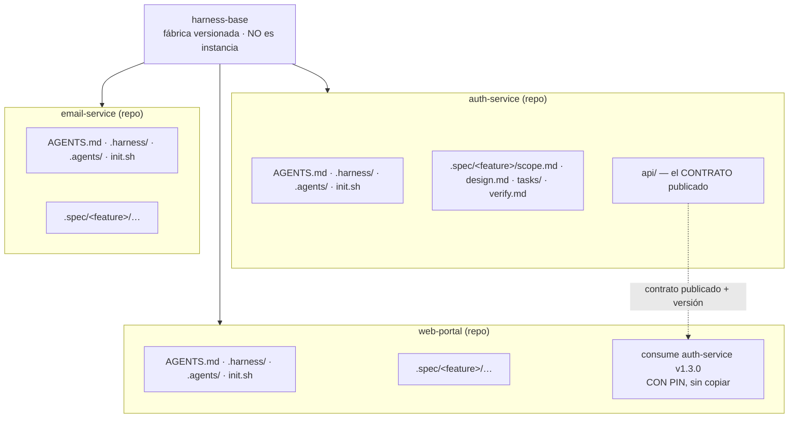

# ADR-012 — Un solo nivel de instanciación: el repositorio es la unidad de mantenimiento

- **Fecha**: 2026-09-28
- **Estado**: `aceptada` · **Implementación**: **PENDIENTE**
- **Decisor**: Juan Moreno (responsable del harness)
- **Feature**: `_harness`
- **Reemplaza**: el «nivel 2 — Proyecto» de `docs/propuesta-harness-instanciable.md` §3
- **Tareas afectadas**: `AGENTS.md` §3 (convención de `.spec/`), `docs/propuesta-harness-instanciable.md` §3

## Contexto

La propuesta de harness instanciable definía **tres niveles**: harness (1), proyecto (2) y componente (3).
El nivel 2 se introdujo para tener dónde ubicar el **contrato** entre componentes, tomando como ejemplo
una feature `auth` con backend y frontend.

Al precisar el escenario real de uso, ese nivel demostró ser un **contenedor inventado**:

> «Entre estos componentes no hay relación entre sí, por lo cual la especificación no es a nivel de
> proyecto/aplicación. El comportamiento del componente debe estar única y exclusivamente en su
> entorno, que luego yo puedo commitear y el cambio llega al `main` del repositorio, y otro
> desarrollador toma esa versión y continúa con los cambios que le pidan como contribuidor.»
> — responsable del harness

Escenario concreto que lo motiva:

- Un mismo actor (**un desarrollador Full Stack**) clona y mantiene **N componentes heterogéneos**:
  varios backends, varios frontends, microservicios (correo, mensajería, perfiles).
- **Esos componentes no se relacionan entre sí.** No forman una aplicación con alcance propio.
- Cada uno evoluciona por su cuenta y se publica en su propio `main`.
- El consumidor de un cambio prueba **cuando el proveedor lo publica en un ambiente**, no antes.

Además, el propio repositorio del harness ya funcionaba con este modelo sin que se hubiera nombrado:
`.spec/_harness/` no es un «nivel proyecto», es **el harness siendo un componente que se mantiene a sí
mismo**.

## Decisión

**Existe un solo nivel de instanciación: el repositorio. Cada repositorio es autosuficiente y contiene
todo lo necesario para su propio mantenimiento por cualquier actor.**



### Los tres artefactos del contrato

1. **El contrato es propiedad del proveedor.** `auth-service` lo mantiene en su propia `.spec/` (o en
   `api/`): es su API, la versiona y la deprecia.
2. **El consumidor lo consume con pin**, nunca copiándolo. Igual que una dependencia: `auth-service
   v1.3.0`. Esto evita la **sexta duplicación en silencio** del repositorio.
3. **El consumidor prueba contra un ambiente publicado**, no contra el local del proveedor. Por eso el
   «estado publicado» (versión + ambiente) forma parte del contrato.

### Convención de `.spec/`

```
Todo directorio .spec/ pertenece al repositorio que lo contiene.
```

Sin excepciones y sin subcarpetas de ámbito. Un `scope.md` describe el comportamiento del componente
cuyo repositorio lo alberga.

### El único residuo legítimo: el manifiesto de workspace (local)

Cuando un actor mantiene N componentes a la vez, necesita saber **cuáles tiene y en qué versión del
harness**. Eso es un artefacto **local, del actor, no versionado**:

```yaml
# workspace.yaml — entorno local del actor. NO es un artefacto de proyecto.
components:
  - repo: github.com/acme/auth-service     harness: "1.4.0"
  - repo: github.com/acme/email-service    harness: "1.4.0"
  - repo: github.com/acme/web-portal       harness: "1.2.1"   # desactualizado
```

Sirve para dos cosas concretas: ver **qué componentes están desactualizados** respecto al harness, y
saber **qué hay que re-instanciar**. No es un nivel de la arquitectura ni se commitea.

## Alternativas consideradas

| Alternativa | Pros | Contras | Por qué se descarta |
| :--- | :--- | :--- | :--- |
| **A. Tres niveles (harness / proyecto / componente)** — lo propuesto antes | Daba un sitio «natural» al contrato y al alcance de sistema | **Inventa un contenedor para lo que no encaja.** En el escenario real no hay «proyecto»: los componentes no se relacionan. Añade un ámbito que cada agente interpretaría a su manera | El escenario de uso lo desmiente. Un nivel que existe solo para colocar un artefacto es un síntoma, no un diseño |
| **B. `.spec/` solo en el harness, componentes sin spec** | Un único sitio de especificación | Los componentes no tendrían su historia de decisiones; el contribuidor externo no sabría qué cambia ni por qué. Y **R2 sería inejecutable**: el commit del componente no podría incluir su tarea | Rompe R2, el scope check del Verifier y G3 |
| **C. Contrato en un repo propio compartido** | Una sola copia, con versión | Tercer repositorio por cada contrato; el proveedor pierde la propiedad de su API | El contrato es la API del proveedor: su dueño natural es él |
| **D. Un solo nivel; contrato del proveedor con pin en el consumidor** | Sin nivel inventado; cada repo autosuficiente; sin duplicación del contrato; **R2, scope check y G3 ejecutables** | El consumidor depende de que el proveedor publique versión y ambiente | — (la elegida) |

## Consecuencias

**Positivas**
- **Cada repositorio es autosuficiente**: ley + método + gate + spec + versión del harness. Un actor
  nuevo clona uno y tiene todo lo necesario para mantenerlo. Es el requisito central del escenario.
- **Desaparece un nivel completo** de la arquitectura: menos conceptos que un agente deba interpretar
  en arranque en frío.
- **R2, el scope check y G3 pasan a ser ejecutables**: la tarea, su commit y su verificación viven en
  el mismo repositorio.
- `instantiate_harness.py` se simplifica: instancia **un repo**, sin ambigüedad de nivel.
- El contrato **no se duplica**: es del proveedor y el consumidor lo referencia con pin.

**Negativas / deuda asumida**
- Un componente que consume a otro necesita **un ambiente publicado** para poder probar. Sin él, la
  integración no es verificable. Es coste real de tener repos independientes.
- La `.spec/` del proveedor y la del consumidor **no se ven entre sí**: la coordinación ocurre por el
  contrato y el ambiente, no por el repositorio. Requiere disciplina de versionado.
- El manifiesto de workspace es **local**: si se pierde, hay que reconstruirlo a mano.

**Neutrales**
- `harness-base` no se instancia a sí mismo: es la fábrica. Este repositorio es a la vez fábrica **y**
  un componente que se mantiene a sí mismo (`.spec/_harness/`), lo que confirma el modelo.
- ADR-005 (sin perfiles de dominio) se refuerza: la especialización vive en el componente.

## Cómo revertir esta decisión

Reintroducir un nivel intermedio para componentes que **sí** formen una aplicación con alcance de
sistema propio. Debería hacerse **con evidencia** (un caso real con contrato compartido entre varios
componentes de una misma aplicación), no por anticipación.

## Cómo se verificará

1. En un repo de componente: `scope.md`, `design.md`, `tasks/` y `verify.md` residen **todos** en su
   `.spec/`, y el commit de una tarea incluye el archivo de tarea de ese mismo repo (R2).
2. El consumidor declara la **versión** del proveedor que consume, y **no** guarda copia del contrato.
3. Un actor distinto clona el repo, instancia el harness y puede mantenerlo **sin consultar otro
   repositorio**.
4. `init.sh` de cada repo valida **solo** lo suyo.

## Referencias

- `docs/propuesta-harness-instanciable.md` §3 (el nivel 2 que este ADR reemplaza)
- ADR-005 (un solo harness base), ADR-006 (`AGENTS.md` del repo instanciado), ADR-009 (auth)
- `AGENTS.md` §1 R2, §3 (convención de `.spec/`), §8 (criterios del Verifier)
