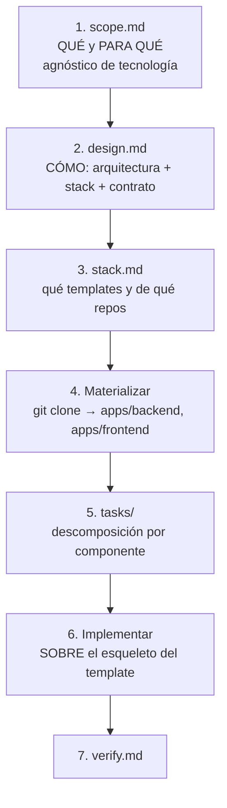

# Inicio — Harness SDD: por dónde seguir

> **Documento de arranque.** Léelo al retomar el trabajo después de un parón. Contiene el estado
> exacto, qué está decidido, qué está bloqueado y cuál es el siguiente paso concreto.
>
> **Última actualización**: 2026-09-27 · **Sesión cerrada en**: commit `5332e3b`
> **Estado global**: 10 ADR aceptados · harness coherente (85 checks) · gate en PASS ·
> **0 aplicaciones construidas**

---

## 1. Resumen en una frase

El **harness está terminado y verificado** en su capa de definición (roles, skills, políticas, gates,
ADRs), pero **nunca se ha ejercitado con código real**: no hay ninguna aplicación, ningún `design.md`,
ningún `tasks/` y ningún `verify.md`. El siguiente hito es **la primera aplicación de prueba**.

---

## 2. Estado exacto del repositorio (verificado, no inferido)

| Comprobación | Resultado |
| :--- | :--- |
| Rama | `main` — commits `6b9052c` → `5332e3b` |
| Último commit | `5332e3b docs: corregir D2 (sin herencia) y el paso 5 segun ADR-005` |
| Remoto git | **NINGUNO** (`git remote -v` vacío) → **R3 y G3 no son ejecutables** |
| `python scripts/validate_harness.py` | **85 comprobaciones, COHERENTE** (exit 0) |
| `bash init.sh` | **PASS** (con `lint`/`format`/`typecheck`/`tests` en **SKIP**) |
| ADRs | 10 (001–010), todos `aceptada`; 004–010 con **implementación pendiente** |
| Sin commitear | `.spec/validator-runner/`, `docs/desacoplamiento-arquitectura-software.md` (previos, deliberadamente fuera) |

### Herramientas del entorno

| Herramienta | Estado |
| :--- | :--- |
| Python 3.13.8 · Node · Go · git · bash | Presentes |
| PHP 8.2.12 (`D:\xampp\php`) · Composer 2.8.12 | Presentes (XAMPP) |
| Extensiones PHP para Laravel | Presentes (pdo_sqlite, pdo_mysql, mbstring, openssl, tokenizer, xml, curl, fileinfo, bcmath) |
| `ruff` · `mypy` · `pytest` | **Ausentes** |
| `phpunit` global (XAMPP) | **ROTO** (warning PEAR) → usar `vendor/bin/phpunit` |
| Laravel Installer global | 3.0.1 (**antiguo**) → usar `composer create-project laravel/laravel:^12.0` |
| `gh` (GitHub CLI) · `docker` · `java` | **Ausentes** |

---

## 3. Lo que está decidido (ADR-004 a ADR-010)

Respuesta a las decisiones abiertas **A1–A7** de `docs/propuesta-harness-instanciable.md`:

| ADR | Decisión | Consecuencia práctica |
| :--- | :--- | :--- |
| **004** | Versión única en `.harness/harness.version` + check que **falla si diverge** | Habilita fijar la versión del harness al instanciar |
| **005** | **Un solo harness base**; especialización en el nivel 3. **Sin herencia, sin perfiles** | Elimina trabajo: no hay mecanismo que construir |
| **006** | El `AGENTS.md` del proyecto es **generado** (ley + parámetros) | Corrige que §4 de la ley describa `src/`; check de sincronización |
| **007** | Rol nuevo **`harness-maintainer`**; `scripts/` cerrado al Developer | Desbloquea `validator-runner` **y** el materializador de stack |
| **008** | Ciclo SDD **completo para toda aplicación**, sin umbral de tamaño | Frontera por **naturaleza**, no por tamaño (verificable, R5) |
| **009** | Primera aplicación: **auth (correo + contraseña)**, **dos componentes**: backend **Laravel 12 / PHP 8.2** y frontend **Vue** | Ver §5: tiene un **bloqueo** |
| **010** | **Remoto privado en GitHub** | Habilita R3 y G3 |

Los ADR están en `.spec/_harness/ADR/` y el índice en `ADR/README.md`.

### Roles humanos asignados

| Rol | Persona |
| :--- | :--- |
| Responsable del harness / Product Owner | **Juan Moreno** |
| **Tech Lead humano** | **Juan Moreno** |

> Una misma persona puede ocupar ambos roles. Lo que la ley prohíbe es que un **agente** apruebe un
> cambio de governance o su propio gate (§7). ADR-007 queda **co-firmado** con esta asignación.

---

## 4. Los tres huecos que impiden avanzar (medidos)

### Hueco 1 — El gate está inerte para PHP (el más importante)

`init.sh` **detecta `composer.json`** en su lista de manifiestos, pero sus ramas de `lint`, `format`,
`typecheck` y `tests` solo cubren `pyproject.toml`, `package.json` y `go.mod`. **No hay rama PHP.**

Consecuencia en un proyecto Laravel:

```
○ lint         no aplica     ← PHP no tiene rama
○ format       no aplica     ← PHP no tiene rama
○ typecheck    no aplica     ← PHP no tiene rama
○ tests        no aplica     ← PHP no tiene rama
== GATE: PASS ==              ← PASS sin comprobar nada
```

Esto afecta a **cualquier** stack fuera de la tríada Python/Node/Go: revela que el gate tiene
conocimiento de stack **embebido**, que es justo el acoplamiento que el nivel 3 viene a eliminar.

**Arreglo**: PR de harness (R4, requiere aprobación humana). **`init.sh` es intocable por agentes.**

### Hueco 2 — Sin remoto, R3 y G3 no son ejecutables

R3 dice «el agente abre PR; un humano aprueba y mergea». Sin remoto no hay PR. **Arreglo**: ADR-010
(alta manual, la haces tú). `gh` no está instalado.

### Hueco 3 — `scripts/` sin rol que lo escriba

Resuelto **en decisión** por ADR-007 (`harness-maintainer`), **pendiente de implementación**.
Necesario para `validator-runner` y para el materializador de nivel 3.

---

## 5. Decisión pendiente de tu respuesta

De la última conversación, quedó **una pregunta sin cerrar**: el **orden** entre arrancar el SDD y
arreglar el gate PHP.

**Mi recomendación (opción 3, corregida):**

> **Arrancar el SDD ahora, y escribir la rama PHP del gate cuando exista el proyecto Laravel real.**

Razonamiento: **no se puede escribir bien la rama PHP sin ver un proyecto Laravel en disco.** No se
sabe si Pint o PHPStan estarán en `composer.json`, ni qué devuelven, ni si Larastan necesita
configuración. Escribirlo antes sería un gate especulativo — el mismo error de secuencia que ADR-005
evita con los perfiles de dominio.

Consecuencia asumida: **las tareas se implementan con el gate en SKIP** durante la fase 1. La deuda
queda registrada en ADR-009 y **el template NO se declara «estándar» hasta que el gate verifique de
verdad.**

### Dos decisiones menores pendientes

| # | Pregunta | Nota |
| :--- | :--- | :--- |
| 1 | ¿Creas el **remoto privado** de ADR-010? | ~5 min, operación manual tuya. Guía en §12. Sin él, G3 no cierra |
| 2 | ~~¿Co-firma de ADR-007?~~ | **RESUELTO**: Juan Moreno es el Tech Lead humano → co-firmado |

---

## 6. El plan concreto (guía de arranque)

Me pediste una guía para el módulo de auth. **La guía correcta es el propio flujo SDD**: yo no escribo
`scope.md` (eso es `sdd-init`), y **G1 lo apruebas tú** antes de que exista `design.md`.

| Paso | Quién | Qué | Gate |
| :--- | :--- | :--- | :--- |
| **0** | **Tú** | Crear el remoto privado (ADR-010) | — |
| **1** | `sdd-init` | `.spec/auth-laravel/scope.md` con criterios verificables y no-objetivos | **se detiene** |
| **2** | **Tú** | Escribir `Aprobado por: Juan Moreno - <fecha>` en `scope.md` | **G1** |
| **3** | `sdd-tech-lead` | `design.md` + `tasks/NNN-*.md` | **se detiene** |
| **4** | **Tú** | Aprobar el plan | **G2** |
| **5** | `sdd-developer` | Una tarea, un commit `sdd: task NNN - ...`, por cada tarea | — |
| **6** | `harness-maintainer` / tú | Rama PHP del gate (PR de harness) | revisión humana |
| **7** | `sdd-verifier` | `.spec/auth-laravel/verify.md` con la salida literal del gate | **G3** |

**Alcance confirmado de la aplicación (A6):**

| Parámetro | Valor |
| :--- | :--- |
| Componentes | **2**: `backend` (Laravel 12 · PHP 8.2 · Composer) y `frontend` (Vue 3 · Vite · npm) |
| Base de datos | SQLite (local, sin Docker) o MySQL de XAMPP |
| Modo | Ciclo SDD **completo**, por componente (ADR-008) |
| Funcionalidad | Registro con correo + contraseña + **validación de contraseña**, **activación por enlace enviado por correo**, login, logout, recuperación de contraseña |
| Contrato | `.spec/auth/contracts/api.openapi.yaml` — **única costura** entre componentes |
| Implementación | **Desde cero** — sin Breeze ni Jetstream (el agente escribe el código) |
| Objetivo | **Ejercitar las 4 fases y los 3 gates**, no cubrir requisitos de producción |

**Por qué auth es buen primer caso**: ejercita entrada de usuario, autorización/sesiones, migraciones
de esquema (tabla de usuarios + tokens de activación), contraseñas y hashing, dependencias nuevas de
Composer y npm, y **el contrato entre dos componentes**. Activa el rol `sdd-security-reviewer`, que
**hasta hoy no se ha usado nunca**.

### Orden: la especificación funcional va ANTES que la tecnología

Respuesta a una duda de fondo planteada al cerrar: **primero el QUÉ `scope.md`, después el CÓMO
`design.md`**. El harness lo tiene codificado en los roles — `sdd-init` tiene prohibido elegir
tecnologías.



**La razón**: si se empieza por la tecnología, los criterios de aceptación quedan **atados a la
implementación**. Comparación con el caso real:

| | Criterio |
| :--- | :--- |
| ❌ Atado a tecnología | «el endpoint `POST /api/register` de Laravel devuelve 201» |
| ✅ Funcional | «dado un visitante, cuando se registra con correo válido y contraseña válida, entonces recibe un correo con enlace de activación y su cuenta queda **inactiva** hasta que lo use» |

El segundo es verificable en cualquier stack (**R5**), el primero muere si cambia el backend.

**Además, el contrato debe definirse en `design.md` ANTES de materializar**: backend y frontend son
repos independientes que solo hablan por contrato. Si se materializa el backend primero, el contrato
se descubre tarde y el frontend queda desalineado.

**Matiz legítimo**: para escribir la rama PHP del gate sí hace falta ver un proyecto Laravel real.
Eso es un **spike** (desechable, para aprender el terreno), no implementación (permanente, va contra
`tasks/`). Y en este caso hay simbiosis: **el primer proyecto CREA el template**, así que nace de
criterios bien pensados.

---

## 7. Cómo retomar (para el agente que lea esto)

1. **Leer `AGENTS.md` completo** (precondición obligatoria, §6). Es la ley y prevalece sobre todo.
2. **Leer este documento** para el estado y el punto de continuación.
3. **Comprobar la realidad, no fiarse de este texto**:
   ```bash
   git log --oneline -5
   git status --porcelain
   python scripts/validate_harness.py
   bash init.sh
   ```
4. **No rellenar ningún `Aprobado por:`.** Los gates G1/G2/G3 los aprueba un humano (§7).
5. **No tocar `AGENTS.md`, `.harness/**`, `.agents/**`, `init.sh`, `harness.config.json`** (R4).
   Todo eso va por PR separada con aprobación humana.

### Reglas que muerden si se olvidan

| Regla | Qué implica aquí |
| :--- | :--- |
| **R1** | No se escribe código hasta que `scope.md`, `design.md` y `tasks/` existen y están confirmados |
| **R2** | Una tarea = un commit. Mensaje `sdd: task NNN - ...` |
| **R3** | Nunca auto-merge |
| **R4** | El agente no modifica el harness para «hacer pasar» una tarea |
| **R6** | `init.sh` es el único gate. Prohibido saltarlo o desactivar checks |
| **R7** | Prohibido debilitar tests |
| **R9** | Sin secretos en disco (ninguna API key, token ni credencial) |

---

## 8. Trampas conocidas (evitar repetir errores ya cometidos)

Van **cuatro ocurrencias** del mismo fallo en este repositorio: **un dato crítico en copias que
divergen en silencio**.

| # | Caso | Dónde quedó registrado |
| :--- | :--- | :--- |
| 1 | Validar nombres de modelo contra la **fuente equivocada** (docs de API en vez del catálogo del runtime) | ADR-001 |
| 2 | Confundir **catálogo nativo** con el aportado por una **extensión** | ADR-002 |
| 3 | Vínculos **agente ↔ skill** escritos en prosa, sin check. 3 de 8 incompletos | ADR-003 |
| 4 | **Cinco versiones** del harness independientes, sin coordinación | ADR-004 |

**Lección transversal**: *un validador que nunca ha fallado no ha demostrado nada.* Cuando se añada un
check, **probarlo con un fixture que deba fallar** y confirmar el código 1 antes de darlo por bueno.

### Otras trampas verificadas

- **`phpunit` global de XAMPP está roto.** Usar siempre `vendor/bin/phpunit`.
- **Laravel Installer global es 3.0.1** (antiguo). Usar `composer create-project laravel/laravel:^12.0`.
- **Añadir campos al frontmatter de `SKILL.md` es peligroso**: VS Code solo admite cinco
  (`name`, `description`, `argument-hint`, `user-invocable`, `disable-model-invocation`) y un campo
  desconocido produce un **fallo silencioso de descubrimiento**.
- **Comandos multilínea en PowerShell pierden salida.** Encadenar con `;` en una sola línea.

---

## 9. Documentos de referencia

| Documento | Contenido |
| :--- | :--- |
| [`AGENTS.md`](../AGENTS.md) | **La ley.** R1–R10, gates G1–G3, estándares, Definition of Done |
| [`docs/propuesta-harness-instanciable.md`](./propuesta-harness-instanciable.md) | Modelo de **tres niveles**, decisiones D1–D3, decisiones abiertas A1–A7, anexos A3/A4 |
| [`docs/desacoplamiento-arquitectura-software.md`](./desacoplamiento-arquitectura-software.md) | Diseño del **nivel 3**: `stack.md`, `template.yaml`, `agent_profile.md` |
| [`.spec/_harness/ADR/README.md`](../.spec/_harness/ADR/README.md) | Índice de los 10 ADR |
| [`README.md`](../README.md) | Estado del harness y diagnóstico de las 9 dimensiones |
| `.spec/validator-runner/scope.md` | Feature **varada**: es una automatización de `scripts/`, no una feature de dominio (reclasificar como chore) |

---

## 10. Orden de implementación (visión completa)

| Paso | Qué | Estado |
| :--- | :--- | :--- |
| **0** | Reclasificar `validator-runner` como **chore** de harness | Pendiente |
| **1** | **Activar el gate**: rama PHP en `init.sh` + remoto git | **Bloquea la verificación real** |
| **2** | **Versión única del harness** (ADR-004) | Decidido, sin implementar |
| **3** | **`instanciar-harness`** (ADR-006) | Decidido, sin implementar |
| **4** | **Primera aplicación**: auth Laravel 12 → **AQUÍ ESTAMOS** | Listo para arrancar |
| **5** | **Segunda aplicación de otro tipo** — revela el delta real entre dominios | Futuro |
| **6** | **Materializador de stack** (nivel 3) + templates | Futuro |

> El paso 4 es el que aporta la información que **no se puede obtener leyendo**: los huecos que solo
> aparecen cuando el flujo se ejecuta. Los pasos 5 y 6 deben llegar **después**, para no hornear
> supuestos en `AGENTS.md`, que es el sitio más caro de cambiar.

---

## 11. Siguiente acción concreta

```
1. Crear el remoto privado en GitHub (ADR-010).                  ← TÚ, ~5 min (§12)
2. Lanzar `sdd-init` para la feature `auth`.                     ← agente
3. Revisar el `scope.md` y aprobar G1 escribiendo:               ← TÚ
   Aprobado por: Juan Moreno - 2026-09-XX
```

Ese es el punto exacto de continuación. Todo lo anterior está en disco y verificado.

> **Nota sobre el slug**: la feature pasa a llamarse `auth` (no `auth-laravel`), porque abarca **dos
> componentes** (Laravel + Vue) y el slug no debe nombrar una tecnología.

---

## 12. Guía: crear el repositorio en GitHub

Operación **humana**, sin agentes. No hay que pegar ninguna credencial en el repo (R9).

**Paso 1 — Crear el repositorio vacío** en `github.com/new`:
- **Name**: `ai-harness-architecture`
- **Visibility**: **Private** (ADR-010)
- **NO marcar** «Add a README», «Add .gitignore» ni «Choose a license»
  → **crítico**: el repo ya tiene esos archivos; inicializarlo crea un commit que choca con la historia.

**Paso 2 — Copiar la URL** que GitHub muestra: `https://github.com/<usuario>/ai-harness-architecture.git`

**Paso 3 — Vincular y subir**:
```bash
git remote add origin https://github.com/<usuario>/ai-harness-architecture.git
git branch -M main
git push -u origin main
```

**Paso 4 — Autenticación**: la primera vez, Git Credential Manager abre el navegador. No escribir
tokens en archivos del repo.

**Paso 5 — Subir la rama histórica** (opcional): `git push -u origin spec/harness-adr`
(git rm apunta a `c72bbb7`, ya ancestro de `main`; se puede conservar o borrar con `git branch -d`).

**Paso 6 — Proteger `main`** (Settings → Branches → Add rule):
- Branch name pattern: `main`
- ☑ Require a pull request before merging · ☑ Require approvals: **1**
- ☐ **NO** activar «Allow force pushes» (R3)

Esto es lo que hace **R3 y G3 ejecutables de verdad**; sin ello son convención, no control.

**Paso 7 — Verificar**:
```bash
git remote -v
git log --oneline origin/main -3
```

**Prohibido**: `git push --force` a `main` (R3) y subir `.env` con valores (R9). El `.gitignore` ya
protege `.env` y solo permite `.env.harness`, que contiene **nombres** de variables.

### Auditoría previa al push (hecha el 2026-09-27)

| Comprobación | Resultado |
| :--- | :--- |
| Patrones de credencial (`sk-`, `ghp_`, `AIza`, etc.) | **Cero coincidencias** |
| `.env` con valores rastreado | No (solo `.env.harness`, con nombres) |
| Rutas absolutas de máquina | **1**: `.spec/_harness/diagnostic.md:94` (ruta local en un run antiguo). Irrelevante en repo **privado**; limpiar antes de publicar |
| Tamaño del repositorio | 0.4 MB |
