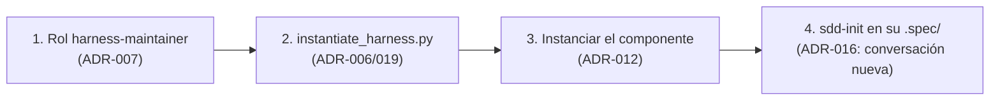
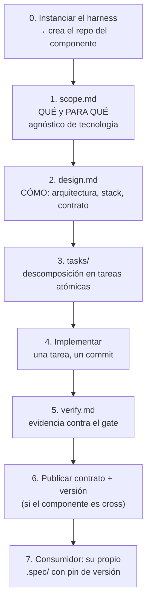

# Inicio — Harness SDD: por dónde seguir

> **Documento de arranque.** Léelo al retomar el trabajo después de un parón. Contiene el estado
> exacto, qué está decidido, qué está bloqueado y cuál es el siguiente paso concreto.
>
> **Lista concreta de pendientes**: [`docs/pendientes.md`](./pendientes.md) — ayuda memoria de traspaso
> con los pendientes y las decisiones abiertas.
>
> **Última actualización**: 2026-10-04 · **Estado global**: **19 ADR** · harness coherente (**136 checks**)
> · gate en PASS · remoto GitHub creado y sincronizado · **1 componente instanciado**
> (`a:\proyectos\auth-service`), **0 features implementadas**.
>
> **Modelo vigente (ADR-012)**: **un solo nivel de instanciación — el repositorio.** Cada repo
> instanciado es autosuficiente: ley + método + gate + `.spec/` + versión del harness. El contrato es
> **propiedad del proveedor**; el consumidor lo referencia **con pin**.

---

## 1. Resumen en una frase

El **harness está terminado, verificado y ya instanciado**: 19 ADR, 136 comprobaciones y un componente
real creado en `a:\proyectos\auth-service`. Pero **ninguna feature se ha implementado todavía**: no hay
`design.md`, ni `tasks/`, ni `verify.md` en ningún componente. El siguiente hito es **lanzar `sdd-init`
en el componente** y recorrer el ciclo completo.

---

## 2. Estado exacto del repositorio (verificado, no inferido)

| Comprobación | Resultado |
| :--- | :--- |
| Rama | `main`, sincronizada con `origin/main` |
| Remoto git | **`origin` → `github.com/juanmorenomotta/ai-harness-architecture`** (privado) |
| Protección de `main` | **Creada pero INERTE** (repo privado + plan Free). Ver §4, hueco 2 |
| `python scripts/validate_harness.py` | **136 comprobaciones, COHERENTE** (exit 0) |
| `bash init.sh` | **PASS** (con `lint`/`format`/`typecheck`/`tests` en **SKIP**) |
| ADRs | **19** (001–019). Implementados: **004, 007, 015, 016, 017, 018, 019** |
| Sin commitear | `.spec/validator-runner/`, `docs/desacoplamiento-arquitectura-software.md` (previos, deliberadamente fuera) |

### Herramientas del entorno

| Herramienta | Estado |
| :--- | :--- |
| Python 3.13.8 · Node · Go · git · bash | Presentes |
| PHP 8.2.12 (`D:\xampp\php`) · Composer 2.8.12 | Presentes (XAMPP) |
| Extensiones PHP para Laravel | Presentes (pdo_sqlite, pdo_mysql, mbstring, openssl, tokenizer, xml, curl, fileinfo, bcmath) |
| `ruff` · `mypy` · `pytest` | **Ausentes** |
| `phpunit` global (XAMPP) | **ROTO** (warning PEAR) → usar `vendor/bin/phpunit` |
| Laravel Installer global | 3.0.1 (**antiguo**) → usar `composer create-project laravel/laravel:^12.0` |
| `gh` (GitHub CLI) · `docker` · `java` | **Ausentes** |

---

## 3. Lo que está decidido (ADR-004 a ADR-019)

| ADR | Decisión | Consecuencia práctica |
| :--- | :--- | :--- |
| **004** | Versión única en `.harness/harness.version` + check que **falla si diverge** | Habilita fijar la versión del harness al instanciar |
| **005** | **Un solo harness base**; especialización en el nivel del componente. **Sin herencia, sin perfiles** | Elimina trabajo: no hay mecanismo que construir |
| **006** | El `AGENTS.md` de **cada repo instanciado** es **generado** (ley + parámetros) | Corrige que §4 de la ley describa `src/`; check de sincronización |
| **007** | Rol nuevo **`harness-maintainer`**; `scripts/` cerrado al Developer | Desbloquea `validator-runner` **y** el materializador |
| **008** | Ciclo SDD **completo para toda aplicación**, sin umbral de tamaño | Frontera por **naturaleza**, no por tamaño (verificable, R5) |
| **015** | Los adaptadores llevan el **procedimiento del rol** (los 6; antes 5 no lo llevaban) | Se verifica **por contenido**, no comparando el generado consigo mismo |
| **016** | El arranque en frío se consigue con **conversación nueva**, no con la selección de agente | **Una conversación por fase y por tarea** |
| **017** | El maintainer puede **ampliar** el gate, no vaciarlo | `init.sh` y `harness.config.json` escribibles, con check de integridad |
| **018** | La **identidad** del repositorio se declara y verifica | Dos severidades: aviso en el harness, error en un componente |
| **019** | El **instanciador** extrae del propio árbol con `git archive` | Sin red ni credenciales; exige árbol limpio; modo `--check` |
| **009** | Primer componente: **`auth-service`**, clase **`cross`**, Laravel 12 / PHP 8.2 + consumidor frontend Vue | Ver §5: tiene un **bloqueo** |
| **010** | **Remoto privado en GitHub** | Habilita R3 y G3 |
| **011** | **G3 es revisión humana LOCAL**; la protección de rama es **inerte** | Ver §4: R3 no es control técnico |
| **012** | **Un solo nivel de instanciación: el repositorio.** Se elimina el «nivel proyecto» | Contrato = propiedad del proveedor; consumidor con **pin**. `.spec/` siempre en el repo que lo contiene |
| **013** | Clase **`cross`**: componentes consumidos por terceros | `ownership` declarado + `CODEOWNERS` + contrato versionado + gate **G4** |
| **014** | **Contribución externa**: rama `contrib/<change-id>` y PR al owner | Regla del «mismo humano en dos sombreros»: se **declara** en `verify.md` |

Los ADR están en `.spec/_harness/ADR/` y el índice en `ADR/README.md`.

### Roles humanos asignados

| Rol | Persona |
| :--- | :--- |
| Responsable del harness / Product Owner | **Juan Moreno** |
| **Tech Lead humano** | **Juan Moreno** |

> Una misma persona puede ocupar ambos roles. Lo que la ley prohíbe es que un **agente** apruebe un
> cambio de governance o su propio gate (§7). ADR-007 queda **co-firmado** con esta asignación.

---

## 4. Huecos detectados (medidos)

Los tres huecos originales están **resueltos o desbloqueados**: el gate sin rama PHP (pendiente 5,
pendiente de código real), R3 como regla de proceso (ADR-011) y `scripts/` sin rol que lo escriba
(ADR-007/017). Se conservan aquí como registro de lo que reveló cada uno.

### Hueco 1 — El gate está inerte para PHP (el más importante)

`init.sh` **detecta `composer.json`** en su lista de manifiestos, pero sus ramas de `lint`, `format`,
`typecheck` y `tests` solo cubren `pyproject.toml`, `package.json` y `go.mod`. **No hay rama PHP.**

Consecuencia en un proyecto Laravel:

```
○ lint         no aplica     ← PHP no tiene rama
○ format       no aplica     ← PHP no tiene rama
○ typecheck    no aplica     ← PHP no tiene rama
○ tests        no aplica     ← PHP no tiene rama
== GATE: PASS ==              ← PASS sin comprobar nada
```

Esto afecta a **cualquier** stack fuera de la tríada Python/Node/Go: revela que el gate tiene
conocimiento de stack **embebido**, que es justo el acoplamiento que el nivel 3 viene a eliminar.

**Arreglo**: PR de harness (R4, requiere aprobación humana). **`init.sh` es intocable por agentes.**

### Hueco 2 — R3 y G3 NO son controles técnicos (hallazgo 2026-09-27)

R3 dice «el agente abre PR; un humano aprueba y mergea». Verificado contra la documentación oficial
de GitHub:

1. **La protección de rama no existe en repositorios privados con plan Free.** GitHub lo avisa al
   activarla: «Tus reglas no se aplicarán en este repositorio privado hasta que migres a una cuenta
de organización de GitHub Team». La regla **se guarda pero no se aplica**.
2. **Aunque se pagara, no bastaría**: los administradores se saltan las reglas por defecto, y
   **GitHub ve una sola identidad** — los agentes usan la terminal y las credenciales del humano. Una
   prueba: el `git push origin main` de esta sesión pasó sin barrera alguna.

**Conclusión**: R3 es hoy una **regla de proceso, no un control técnico** (ADR-011). No se arregla
pagando: se arregla **separando identidades** (PAT o GitHub App de menor privilegio para agentes).

**Mitigación actual**: G3 se ejecuta como **revisión humana LOCAL** — el humano revisa `verify.md` y
el diff antes de que llegue a `main`. El flujo SDD se ejercita íntegro; falta el mecanismo técnico.

> **No contarla como cumplimiento de R3** en `verify.md` mientras sea inerte: misma lógica por la que
> un check en `SKIP` no debe contarse como `PASS`.

### Hueco 3 — `scripts/` sin rol que lo escriba

Resuelto **en decisión** por ADR-007 (`harness-maintainer`), **pendiente de implementación**.
Necesario para `validator-runner` y para el materializador de nivel 3.

---

## 5. Estado de los bloqueos (actualizado 2026-10-04)

**Los cuatro eslabones están resueltos.** El flujo SDD ya es ejecutable.



| # | Eslabón | Estado |
| :--- | :--- | :--- |
| 1 | Rol `harness-maintainer` | ✅ **RESUELTO** (2026-10-04, ADR-007/017) |
| 2 | `scripts/instantiate_harness.py` | ✅ **RESUELTO** (2026-10-04, ADR-019) |
| 3 | Repositorio del componente | ✅ **HECHO**: `a:\proyectos\auth-service` |
| 4 | `sdd-init` escribiendo `scope.md` | ▶️ **SIGUIENTE** — en conversación nueva |

### El orden correcto

| Orden | Qué | Estado |
| :--- | :--- | :--- |
| **1º** | **Rol `harness-maintainer`** (ADR-007) | ✅ Hecho |
| **2º** | **`instantiate_harness.py`** (ADR-006/019) + versión única (ADR-004) | ✅ Hecho |
| **3º** | **Instanciar `auth-service`** | ✅ Hecho en `a:\proyectos\auth-service` |
| **4º** | **SDD del componente** (fases 1–7 de §7) | ▶️ Siguiente |
| **5º** | **Rama PHP del gate** | Pendiente, cuando exista código Laravel |


> **Sobre el gate PHP**: la recomendación no cambia — escribirlo **cuando exista el proyecto Laravel**,
> porque no se puede hacer bien sin ver un `composer.json` real. Lo que cambia es que **ya no es el
> primer bloqueo**: antes hay que crear el componente.

### Decisiones menores: resueltas

| # | Pregunta | Estado |
| :--- | :--- | :--- |
| 1 | ¿Remoto privado? (ADR-010) | **HECHO**: `origin` configurado, push realizado |
| 2 | ¿Co-firma de ADR-007? | **RESUELTO**: Juan Moreno es el Tech Lead humano → co-firmado |
| 3 | Protección de rama | **Creada e inerte** (ADR-011). Se conserva para que se active al migrar de plan |

---

## 6. Alcance del primer componente y orden spec↔tecnología

> **La guía operativa está en §7.** Esta sección solo fija **qué** se va a construir y **en qué orden**
> se decide cada cosa.

**Alcance confirmado (A6), corregido a ADR-012/ADR-013:**

| Parámetro | Valor |
| :--- | :--- |
| Componentes | **2 repos independientes**: `auth-service` (clase **`cross`**, Laravel 12 · PHP 8.2) y un **consumidor** frontend (Vue 3 · Vite) |
| Dónde viven | Cada uno en **su propio repositorio**, creados **instanciando el harness**. Nunca dentro del harness |
| Base de datos | SQLite (local, sin Docker) o MySQL de XAMPP |
| Modo | Ciclo SDD **completo**, por componente (ADR-008) |
| Funcionalidad | Registro con correo + contraseña + **validación**, **activación por enlace enviado por correo**, reenvío, login, logout, recuperación |
| Contrato | **Propiedad de `auth-service`** (`api/openapi.yaml`), versionado. El consumidor lo referencia **con pin** |
| Implementación | **Desde cero** — sin Breeze ni Jetstream (el agente escribe el código) |
| Objetivo | **Ejercitar las 4 fases y los 4 gates (G1–G4)**, no cubrir requisitos de producción |

**Por qué auth es buen primer caso**: ejercita entrada de usuario, autorización/sesiones, migraciones
de esquema (usuarios + tokens de activación), contraseñas y hashing, dependencias nuevas de Composer y
npm, **el contrato entre dos repos** y el gate **G4** de compatibilidad. Activa el rol
`sdd-security-reviewer`, que **hasta hoy no se ha usado nunca**.

### Orden: la especificación funcional va ANTES que la tecnología

**Primero el QUÉ (`scope.md`), después el CÓMO (`design.md`).** El harness lo tiene codificado en los
roles — `sdd-init` tiene prohibido elegir tecnologías.



**La razón**: si se empieza por la tecnología, los criterios de aceptación quedan **atados a la
implementación**. Comparación con el caso real:

| | Criterio |
| :--- | :--- |
| ❌ Atado a tecnología | «el endpoint `POST /api/register` de Laravel devuelve 201» |
| ✅ Funcional | «dado un visitante, cuando se registra con correo válido y contraseña válida, entonces recibe un correo con enlace de activación y su cuenta queda **inactiva** hasta que lo use» |

El segundo es verificable en cualquier stack (**R5**), el primero muere si cambia el backend.

**Matiz legítimo**: para escribir la rama PHP del gate sí hace falta ver un proyecto Laravel real.
Eso es un **spike** (desechable, para aprender el terreno), no implementación (permanente, va contra
`tasks/`). Y en este caso hay simbiosis: **el primer componente CREA el template**, así que nace de
criterios bien pensados.

### Estructura de repositorios (ADR-012: un solo nivel)

**No hay nivel «proyecto».** Cada repositorio es autosuficiente y contiene todo lo necesario para su
mantenimiento por cualquier actor:

```
auth-service/                  ← repo 1 (clase cross)
  AGENTS.md .harness/ .agents/ init.sh
  api/openapi.yaml             ← EL CONTRATO: es suyo, lo versiona
  .spec/<feature>/             ← scope, design, tasks, verify
  src/

web-portal/                    ← repo 2 (consumidor)
  AGENTS.md .harness/ .agents/ init.sh
  .spec/<feature>/             ← su propia spec de integración
  src/
  → consume auth-service v1.3.0 CON PIN (no copia el contrato)
```

---

## 7. GUÍA PASO A PASO — ejecutar el flujo tú mismo

Esta es la guía operativa. Cada paso indica **quién** lo hace y **cómo saber que salió bien**. Los
pasos con 👤 son tuyos y no los puede hacer un agente (gates humanos y operaciones de GitHub).

> 🔴 **REGLA DE ORO DE ESTA GUÍA (ADR-016)**: cada fase se lanza en una **CONVERSACIÓN NUEVA** de VS Code,
> con el agente ya seleccionado. **No cambies de agente dentro de la misma conversación**: el agente
> hereda el historial y se pierde el arranque en frío que exige `AGENTS.md` §6.
>
> Se verificó el 2026-10-04: con el agente `harness-maintainer` seleccionado en un chat **existente**,
> respondió con contenido de la conversación; en un chat **nuevo**, dijo que no sabía de qué se hablaba
> y fue a leer el repositorio. **La selección no aísla; la conversación nueva sí.**
>
> Consecuencia: **una conversación nueva por fase, y una por cada tarea** en la fase de implementación.

> ⚠️ **CORRECCIÓN 2026-09-28.** Una versión anterior de esta guía empezaba con
> `git checkout -b spec/auth-service` **dentro del harness**, y escribía `.spec/auth-service/` aquí.
> **Era un error**: contradecía ADR-012 (el `.spec/` pertenece al repositorio que lo contiene). Los
> artefactos de un componente **no** se escriben en el repositorio del harness. La guía corregida
> empieza por **instanciar el componente**.
>
> **Y ese paso ya es ejecutable**: `scripts/instantiate_harness.py` existe (ADR-019). Ver §12 y §11.

### Dónde vive cada cosa (antes de empezar)

```
a:\proyectos\                        ← EL WORKSPACE (carpeta simple, NO es un repo git)
│                                       Es local y tuyo: agrupa los componentes de una aplicación.
├── ai-harness-architecture\         ← EL HARNESS (el framework, clonado de GitHub)
│                                       Contiene su propia .spec/ (del framework).
│                                       NO contiene componentes.
├── api-service\                     ← COMPONENTE (su propio repo git)
├── web-portal\                      ← COMPONENTE (su propio repo git)
└── auth-service\                    ← COMPONENTE (su propio repo git)
```

**Reglas**:

1. **Todos son repositorios git independientes** (ADR-012). El workspace **no** es un repo: es solo
   una carpeta que los agrupa. No tiene `.git`, no se versiona.
2. **Un artefacto de un componente nunca se escribe dentro de `ai-harness-architecture`.**
3. El harness se clona **una vez** en el workspace; los componentes se **instancian** desde él.

> **Por qué el workspace es local**: ADR-012 lo llama «manifiesto de workspace» — sirve para saber qué
> componentes tienes y en qué versión del harness van. Es tuyo, no se versiona y no es un nivel de la
> arquitectura.

### Arranque desde cero (si aún no tienes el harness clonado)

Esta subsección es para **empezar en una máquina nueva**. Si ya tienes el harness clonado y el
componente creado, salta directamente a la Fase 0.

### Paso 0.1 — Crear la carpeta del workspace (👤 humano)

```bash
mkdir A:\proyectos
cd A:\proyectos
```

### Paso 0.2 — Clonar el harness desde GitHub (👤 humano)

```bash
git clone https://github.com/juanmorenomotta/ai-harness-architecture.git
cd ai-harness-architecture
```

> El repositorio es **privado**: Git Credential Manager abrirá el navegador la primera vez. No escribas
> tokens en ningún archivo (R9).

> **El harness se clona**, no se instancia: es la fábrica. Lo que se instancia son los **componentes**
> (ADR-012).

### Paso 0.3 — Actualizar el harness antes de instanciar (👤 humano)

```bash
git pull
```

> ⚠️ **Esta es la trampa que más se olvida.** Si no haces `pull`, el componente nace de la versión que
> clonaste, no de la actual. El script te dirá de qué commit extrae, así que puedes comprobarlo en su
> salida.

### Paso 0.4 — Instanciar el componente (👤 humano)

Desde la raíz del harness clonado:

```bash
python scripts/instantiate_harness.py --name api-service --target ..\api-service
```

- `--target ..\api-service` crea el componente **como hermano** del harness, dentro del workspace.
- **No se pasa `--harness-version`**: el script lee la versión y el commit **de su propio árbol**
  (ADR-019). Por eso el `pull` del paso anterior importa.
- Exige que **no haya cambios rastreados sin commitear** en el harness; si los hay, bloquea con exit 2.

Repite este paso **por cada componente**:

```bash
python scripts/instantiate_harness.py --name web-portal --target ..\web-portal
python scripts/instantiate_harness.py --name auth-service --target ..\auth-service
```

### Paso 0.5 — Verificar la instancia (👤 humano)

```bash
python scripts/instantiate_harness.py --check ..\api-service
```

✅ Debe decir **INSTANCIA COHERENTE**. Comprueba que la ley lleva la marca de generado, que §4 existe y
que la procedencia está registrada.

### Paso 0.6 — Abrir VS Code EN EL COMPONENTE

```bash
code ..\api-service
```

> **No abras el harness para trabajar en un componente.** Cada componente tiene su propio `AGENTS.md`,
> su `.agents/` y su `.spec/`. Trabajar en el árbol equivocado es el error que costó corregir la guía
> el 2026-09-28.

A partir de aquí, continúa en **§7, Fase 1** (lanzar `sdd-init` en conversación nueva).

### Resumen del arranque

| Paso | Qué | Resultado |
| :--- | :--- | :--- |
| 0.1 | Crear `A:\proyectos` | Workspace (carpeta simple) |
| 0.2 | `git clone` del harness | El framework, dentro del workspace |
| 0.3 | `git pull` | El harness al día |
| 0.4 | `instantiate_harness.py` por componente | Un repo por componente |
| 0.5 | `--check` | Instancia coherente |
| 0.6 | `code <componente>` | VS Code en el árbol correcto |

---

### Fase 0 — Instanciar el componente — ✅ **HECHO 2026-10-04**

👤 **Paso 0.1 — El componente ya existe** en `A:\proyectos\auth-service`. No hay que crearlo.

Si necesitas crear **otro** componente (o rehacer este), el comando es:

```bash
cd A:\proyectos\ai-harness-architecture
python scripts/instantiate_harness.py \
    --name <nombre-componente> \
    --target ..\<nombre-componente>
```

> **Nota**: el script se llama **`instantiate_harness.py`** y no recibe `--harness-version`: lee la
> versión y el commit **del propio árbol** (ADR-019, opción D de D-1). Exige que no haya cambios
> **rastreados** sin commitear.

Para comprobar que una instancia sigue coherente:

```bash
python scripts/instantiate_harness.py --check ..\auth-service
```

✅ **Verificado el 2026-10-04**: el componente tiene identidad propia (`name: auth-service`), `.spec/`
vacío, historia git propia y su propio validador en **COHERENTE (136 comprobaciones)** con el gate en
**PASS (exit 0)** — sin consultar el harness. `--check` da **INSTANCIA COHERENTE**.

> **Por qué no basta con copiar la carpeta**: el componente necesita **identidad propia** (nombre,
> ramas, rutas) y **procedencia registrada** (versión + commit del harness) para poder actualizarse
> después (ADR-004, ADR-006, ADR-019).

---

### Fase 1 — `sdd-init` → `scope.md` (QUÉ, sin tecnología)

👤 **Paso 1.1 — Abrir VS Code en el COMPONENTE**, no en el harness:
```bash
code a:\proyectos\auth-service
```

👤 **Paso 1.2 — Invocar el agente EN CONVERSACIÓN NUEVA.** Abre un chat **nuevo** de Copilot (no
continúes uno existente) y:
1. Abre el chat: `Ctrl+Alt+I`
2. Comprueba que el selector de modo dice **Agent** (no «Ask»)
3. Abre el **selector de agentes** (desplegable junto al selector de modelo) y elige **`sdd-init`**
4. Escribe el prompt **funcional, sin tecnología**:

```
Feature: auth-service. Slug: auth-service.

Necesito un servicio de autenticación que otros componentes de mi organización
puedan consumir. Funcionalidad:

1. Un visitante se registra con correo y contraseña. La contraseña se valida
   (longitud mínima y confirmación).
2. El sistema envía un correo con un enlace para activar la cuenta. Hasta que
   el enlace se use, la cuenta NO puede iniciar sesión.
3. El enlace de activación caduca; debe poderse reenviar.
4. Un usuario activado puede iniciar sesión y cerrar sesión.
5. Un usuario puede recuperar su contraseña por correo.
6. Es un componente consumido por terceros: su API debe poder evolucionar sin
   romper a los consumidores ya existentes.
```

> **Lo que NO dice el prompt, a propósito**: ni Laravel, ni PHP, ni Vue, ni base de datos. La
> tecnología se decide en `design.md`. Si la mencionas aquí, los criterios de aceptación quedan atados
> a ella.

**Qué hace el agente**: lee `AGENTS.md`, carga la skill `spec-authoring`, y escribe
`.spec/auth-core/scope.md` **en el repositorio del componente**. Después **se detiene solo**.

✅ **Verificar**: existe `A:\proyectos\auth-service\.spec\auth-core\scope.md` con criterios `AC-N`
verificables.

> **Nota sobre el nombre**: el repo es `auth-service` y la feature del primer corte es `auth-core`.
> Si ambos se llamaran igual, la ruta quedaría redundante (`auth-service/.spec/auth-service/`).

---

### Fase 2 — 👤 GATE G1: aprobar el alcance

👤 **Paso 2.1 — Leer y juzgar `.spec/auth-core/scope.md`** (en el repo del componente). Comprueba:
- Cada `AC-N` es **verificable por comando u observación binaria** (R5).
- Hay **no-objetivos** (mínimo 3).
- Los supuestos **abiertos** están marcados como `ABIERTO`.

👤 **Paso 2.2 — Aprobar.** Edita el archivo y escribe **tú** (ningún agente lo rellena):
```markdown
- **Estado**: `aprobado`
- **Aprobado por**: Juan Moreno - 2026-09-28
```

👤 **Paso 2.3 — Commit del alcance** (en el repo del componente):
```bash
cd a:\proyectos\auth-service
git checkout -b spec/auth-core        # la rama de ESTE componente
git add .spec/auth-core/scope.md
git commit -m "spec(auth-core): scope aprobado (G1)"
```

> **Si algo no te convence**: no apruebes. Pide cambios al agente `sdd-init` en el mismo chat. Un G1
> aprobado sobre un alcance malo contamina todo lo que viene después.

---

### Fase 3 — `sdd-tech-lead` → `design.md` + `tasks/`

👤 **Paso 3.1 — Invocar el agente.** Selector de agentes → **`sdd-tech-lead`**:
```
Procesa el alcance de `.spec/auth-core/scope.md`. Ya está aprobado (G1).
```

**Qué produce**: `design.md` (arquitectura, interfaces, **contrato**, alternativas descartadas,
justificación de dependencias), `tasks/NNN-*.md` (una tarea atómica por archivo) y ADRs si hay
decisiones relevantes.

✅ **Verificar**: existen `design.md` y `tasks/001-*.md`.

---

### Fase 4 — 👤 GATE G2: aprobar diseño y plan

👤 **Paso 4.1 — Revisar** que el diseño incluye: interfaces con contratos explícitos, **al menos una
alternativa descartada**, dependencias justificadas, y una estrategia de test.

👤 **Paso 4.2 — Revisar las tareas**: cada una con `## Objetivo`, `## Archivos` (lista cerrada),
`## Criterio de aceptación` y `## Dependencias`. Una tarea de tipo «L» hay que partirla.

👤 **Paso 4.3 — Aprobar** en `design.md`, commit (en el repo del componente):
```bash
git add .spec/auth-core/
git commit -m "spec(auth-core): diseno y plan aprobados (G2)"
```

---

### Fase 5 — `sdd-developer` → código, una tarea por commit

👤 **Paso 5.1 — Invocar el agente por CADA tarea.** Selector → **`sdd-developer`**:
```
Implementa la tarea 001 de `.spec/auth-core/tasks/`. El plan está aprobado (G2).
```

**Qué hace**: crea la rama `task/auth-core/001` **en el repo del componente**, escribe el test que
falla, implementa, ejecuta `./init.sh`, y hace **un** commit `sdd: task 001 - ...`.

✅ **Verificar tras cada tarea**:
```bash
git log --oneline -1        # debe decir: sdd: task NNN - ...
git diff --stat HEAD~1      # solo archivos de la lista ## Archivos de esa tarea
```

👤 **Paso 5.2 — Repetir** para cada tarea: 002, 003, … Avanzar de tarea **una a una**.

> ⚠️ **Hoy el gate dirá PASS sin comprobar PHP** (hueco 1 de §4): los checks saldrán en `SKIP`. Las
> tareas se implementan igual, pero la verificación real llega en la fase 7.

---

### Fase 6 — `sdd-verifier` → `verify.md`

👤 **Paso 6.1 — Invocar el agente.** Selector → **`sdd-verifier`**:
```
Verifica las tareas commiteadas de la feature `auth-core`.
Escribe `.spec/auth-core/verify.md` con la salida literal de ./init.sh.
```

**Qué produce**: `verify.md` con trazabilidad AC↔código, salida **literal** del gate, y veredicto
`PASS` / `PASS-CON-NOTAS` / `FAIL`.

**Esperado en el estado actual**: reportará los checks del gate como **no verificados** (`SKIP`) y
R3 como **no verificable técnicamente**. Eso es **correcto**: es deuda anotada, no un fallo.

---

### Fase 7 — 👤 GATE G3 y cierre

👤 **Paso 7.1 — Revisar `verify.md`** y el diff completo. Comprobar que las deudas están declaradas y
no ocultas.

👤 **Paso 7.2 — Aprobar y mergear** a `main` **del componente**:
```bash
cd a:\proyectos\auth-service
git checkout main
git merge --no-ff spec/auth-core -m "feat(auth-core): autenticacion verificada"
git push origin main
```

👤 **Paso 7.3 — Publicar el contrato y el ambiente** (solo si el componente es `cross`, ADR-013): el
consumidor necesita saber **qué versión** consumir y **dónde probar**. Sin eso, no puede integrarse.

---

### Resumen del ciclo

| Fase | Rol | Artefacto | Gate |
| :--- | :--- | :--- | :--- |
| 1 | `sdd-init` | `scope.md` | → **G1** 👤 |
| 3 | `sdd-tech-lead` | `design.md` + `tasks/` | → **G2** 👤 |
| 5 | `sdd-developer` | código + 1 commit por tarea | — |
| 6 | `sdd-verifier` | `verify.md` | → **G3** 👤 |
| 7 | — | merge a `main` | **G4** 👤 si es `cross` |

---

## 8. Cómo retomar (para el agente que lea esto)

1. **Leer `AGENTS.md` completo** (precondición obligatoria, §6). Es la ley y prevalece sobre todo.
2. **Leer este documento** para el estado y el punto de continuación.
3. **Comprobar la realidad, no fiarse de este texto**:
   ```bash
   git log --oneline -5
   git status --porcelain
   python scripts/validate_harness.py
   bash init.sh
   ```
4. **No rellenar ningún `Aprobado por:`.** Los gates G1/G2/G3/G4 los aprueba un humano (§7).
5. **No tocar `AGENTS.md`, `.harness/**`, `.agents/**`, `init.sh`, `harness.config.json`** (R4).
   Todo eso va por PR separada con aprobación humana.

### Reglas que muerden si se olvidan

| Regla | Qué implica aquí |
| :--- | :--- |
| **R1** | No se escribe código hasta que `scope.md`, `design.md` y `tasks/` existen y están confirmados |
| **R2** | Una tarea = un commit. Mensaje `sdd: task NNN - ...` |
| **R3** | Nunca auto-merge |
| **R4** | El agente no modifica el harness para «hacer pasar» una tarea |
| **R6** | `init.sh` es el único gate. Prohibido saltarlo o desactivar checks |
| **R7** | Prohibido debilitar tests |
| **R9** | Sin secretos en disco (ninguna API key, token ni credencial) |

---

## 9. Trampas conocidas (evitar repetir errores ya cometidos)

Van **siete ocurrencias** del mismo fallo en este repositorio: **un dato crítico o una garantía que
no se comprueba**.

| # | Caso | Dónde quedó registrado |
| :--- | :--- | :--- |
| 1 | Validar nombres de modelo contra la **fuente equivocada** (docs de API en vez del catálogo del runtime) | ADR-001 |
| 2 | Confundir **catálogo nativo** con el aportado por una **extensión** | ADR-002 |
| 3 | Vínculos **agente ↔ skill** escritos en prosa, sin check. 3 de 8 incompletos | ADR-003 |
| 4 | **Cinco versiones** del harness independientes, sin coordinación | ADR-004 |
| 5 | **Garantía aparente**: protección de rama inerte; un `SKIP` contado como `PASS` | ADR-011 |
| 6 | **Un check que no puede fallar**: `--check` comparaba el generado consigo mismo | ADR-015 |
| 7 | **Un protocolo sin mecanismo**: «no asumas contexto» exige conversación nueva | ADR-016 |

**Tres lecciones transversales**:
- *Un validador que nunca ha fallado no ha demostrado nada.*
- *Un límite es real cuando es **capacidad ausente**, no cuando es una instrucción.*
- *Un check solo es real cuando **mira algo distinto de sí mismo**.*

### Otras trampas verificadas

- **`phpunit` global de XAMPP está roto.** Usar siempre `vendor/bin/phpunit`.
- **Laravel Installer global es 3.0.1** (antiguo). Usar `composer create-project laravel/laravel:^12.0`.
- **Añadir campos al frontmatter de `SKILL.md` es peligroso**: VS Code solo admite cinco
  (`name`, `description`, `argument-hint`, `user-invocable`, `disable-model-invocation`) y un campo
  desconocido produce un **fallo silencioso de descubrimiento**.
- **Comandos multilínea en PowerShell pierden salida.** Encadenar con `;` en una sola línea.

---

## 10. Documentos de referencia

| Documento | Contenido |
| :--- | :--- |
| [`AGENTS.md`](../AGENTS.md) | **La ley.** R1–R10, gates G1–G3, estándares, Definition of Done |
| [`docs/pendientes.md`](./pendientes.md) | **Ayuda memoria de traspaso**: los 4 bloqueos, pendientes menores y decisiones abiertas |
| [`docs/propuesta-harness-instanciable.md`](./propuesta-harness-instanciable.md) | Modelo de instanciación, decisiones D1–D3, abiertas A1–A7, anexos A3/A4 |
| [`docs/desacoplamiento-arquitectura-software.md`](./desacoplamiento-arquitectura-software.md) | Diseño del eje de stack: `stack.md`, `template.yaml`, `agent_profile.md` |
| [`.spec/_harness/ADR/README.md`](../.spec/_harness/ADR/README.md) | Índice de los **19 ADR** |
| [`.spec/validator-runner/scope.md`](../.spec/validator-runner/scope.md) | Feature **varada**: reclasificar como chore (5 supuestos ABIERTOS) |

---

## 11. Orden de implementación (visión completa)

| Paso | Qué | Estado |
| :--- | :--- | :--- |
| **0** | Reclasificar `validator-runner` como **chore** de harness | Pendiente |
| **1** | **Activar el gate**: rama PHP en `init.sh` (el **remoto git ya está hecho**) | **Bloquea la verificación real** |
| **1b** | **Separar identidades** agente/humano (PAT o GitHub App de menor privilegio) → R3 pasa a ser control técnico (ADR-011) | **Deuda registrada**; no bloquea la primera prueba |
| **2** | **Versión única del harness** (ADR-004) | Decidido, sin implementar |
| **3** | **`instantiate_harness.py`** (ADR-006/019) | ✅ Hecho |
| **4** | **Primera aplicación**: auth Laravel 12 → **AQUÍ ESTAMOS** | Listo para arrancar |
| **5** | **Segunda aplicación de otro tipo** — revela el delta real entre dominios | Futuro |
| **6** | **Materializador de stack** (nivel 3) + templates | Futuro |

> El paso 4 es el que aporta la información que **no se puede obtener leyendo**: los huecos que solo
> aparecen cuando el flujo se ejecuta. Los pasos 5 y 6 deben llegar **después**, para no hornear
> supuestos en `AGENTS.md`, que es el sitio más caro de cambiar.

---

## 12. Siguiente acción concreta

**El paso 6 (el ciclo SDD del componente) es ejecutable.** No queda ningún bloqueo de harness.

```
1. [HECHO]  Remoto privado, push y protección de rama (inerte, ADR-011)
2. [HECHO]  ADR-012 a ADR-019: arreglo de roles, adaptadores, identidad, gate y instanciador
3. [HECHO]  Rol `harness-maintainer` (ADR-007/017)
4. [HECHO]  `scripts/instantiate_harness.py` + versión única (ADR-004, ADR-019)
5. [HECHO]  Instanciar `auth-service` en `a:\proyectos\auth-service`
6. SIGUIENTE  SDD del componente: fases 1–7 de §7   ← sdd-init, G1, G2, implementar, G3
```

**Ya no queda ningún bloqueo de harness.** El siguiente paso es de uso, no de construcción.

### Para el paso 6

```bash
code a:\proyectos\auth-service        # abrir VS Code EN EL COMPONENTE, no en el harness
```

Después, en **conversación nueva** (ADR-016): seleccionar `sdd-init` y pegar el prompt de §7, Fase 1.

**Lo que esperar**: `scope.md` con criterios verificables. Después lo revisas y apruebas **G1** tú
escribiendo `Aprobado por:`. La deuda conocida es que el gate reportará `lint`/`tests` en **SKIP**
(no hay código) y los checks de PHP hasta el pendiente 5.

> **Nota sobre el slug**: el repo es `auth-service` y la feature del primer corte es `auth-core`.
> Si ambos se llamaran igual, la ruta sería redundante (`auth-service/.spec/auth-service/`).

---

## 13. Guía: crear el repositorio en GitHub

Operación **humana**, sin agentes. No hay que pegar ninguna credencial en el repo (R9).

**Paso 1 — Crear el repositorio vacío** en `github.com/new`:
- **Name**: `ai-harness-architecture`
- **Visibility**: **Private** (ADR-010)
- **NO marcar** «Add a README», «Add .gitignore» ni «Choose a license»
  → **crítico**: el repo ya tiene esos archivos; inicializarlo crea un commit que choca con la historia.

**Paso 2 — Copiar la URL** que GitHub muestra: `https://github.com/<usuario>/ai-harness-architecture.git`

**Paso 3 — Vincular y subir**:
```bash
git remote add origin https://github.com/<usuario>/ai-harness-architecture.git
git branch -M main
git push -u origin main
```

**Paso 4 — Autenticación**: la primera vez, Git Credential Manager abre el navegador. No escribir
tokens en archivos del repo.

**Paso 5 — Subir la rama histórica** (opcional): `git push -u origin spec/harness-adr`
(git rm apunta a `c72bbb7`, ya ancestro de `main`; se puede conservar o borrar con `git branch -d`).

**Paso 6 — Proteger `main`** (Settings → Branches → Add rule):
- Branch name pattern: `main`
- ☑ Require a pull request before merging · ☑ Require approvals: **1**
- ☐ **NO** activar «Allow force pushes» (R3)

> ⚠️ **Corrección (2026-09-27)**: la afirmación «esto hace R3 y G3 ejecutables de verdad» era
> **incorrecta**. En repositorios **privados con plan Free** la regla **se guarda pero no se aplica**,
> y ningún plan la hace efectiva frente a un agente que comparte credenciales con el humano.
> Ver **ADR-011** y §4, hueco 2. La regla se **conserva** para que se active si se migra a
> organización **Team** o superior.

**Paso 7 — Verificar**:
```bash
git remote -v
git log --oneline origin/main -3
```

**Prohibido**: `git push --force` a `main` (R3) y subir `.env` con valores (R9). El `.gitignore` ya
protege `.env` y solo permite `.env.harness`, que contiene **nombres** de variables.

### Auditoría previa al push (hecha el 2026-09-27; el push ya se completó)

| Comprobación | Resultado |
| :--- | :--- |
| Patrones de credencial (`sk-`, `ghp_`, `AIza`, etc.) | **Cero coincidencias** |
| `.env` con valores rastreado | No (solo `.env.harness`, con nombres) |
| Rutas absolutas de máquina | **1**: `.spec/_harness/diagnostic.md:94` (ruta local en un run antiguo). Irrelevante en repo **privado**; limpiar antes de publicar |
| Tamaño del repositorio | 0.4 MB |
