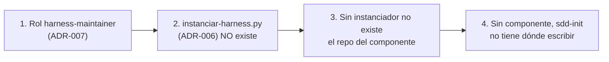

# Pendientes — Ayuda memoria de traspaso

> **Documento de traspaso.** Ayuda memoria para retomar sin pérdida de contexto. Complementa a
> [`inicio-harness-sdd.md`](./inicio-harness-sdd.md), que es el documento de arranque general; **este**
> es la lista concreta de lo que falta por hacer.
>
> **Última actualización**: 2026-10-04 · **Sesión cerrada en**: commit `8ddcb17`
> **Para retomar**: leer `AGENTS.md` → `inicio-harness-sdd.md` → este archivo → verificar el estado
> real con los comandos de §1 (no fiarse de este texto: **caduca**).

---

## 1. Estado exacto (verificado, no inferido)

| Comprobación | Resultado |
| :--- | :--- |
| Rama | `main`, **sincronizada** con `origin/main` (0/0) |
| Último commit | `8ddcb17 fix: copilot adapters carried the law but not the role procedure` |
| Remoto | `origin` → `github.com/juanmorenomotta/ai-harness-architecture` (privado) |
| `python scripts/validate_harness.py` | **123 comprobaciones, COHERENTE** (exit 0) |
| `bash scripts/sync-adapters.sh --check` | **SINCRONIZADOS** (con check de contenido de rol) |
| `bash init.sh` | **PASS** (con `lint`/`format`/`typecheck`/`tests` en **SKIP**) |
| ADRs | **15** (001–015). Implementados: 004, 007, 015. Resto con implementación pendiente |
| Sin commitear | `.spec/validator-runner/`, `docs/desacoplamiento-arquitectura-software.md` (previos, fuera a propósito) |
| Componentes construidos | **NINGUNO** |

### Comandos de verificación obligatorios al retomar

```bash
git log --oneline -6
git status --porcelain
git rev-list --left-right --count HEAD...origin/main
python scripts/validate_harness.py
bash init.sh
```

---

## 2. La cadena de bloqueos

**NADA del flujo SDD es ejecutable todavía.** Los dos primeros eslabones ya están resueltos; quedan dos:



| # | Eslabón | Estado |
| :--- | :--- | :--- |
| 1 | Rol `harness-maintainer` | ✅ **RESUELTO** (2026-10-04, ADR-007) |
| 2 | `scripts/instanciar-harness.py` | ❌ **NO existe** — bloqueado por **D-1** |
| 3 | Repo del componente | ❌ Depende del eslabón 2 |
| 4 | `sdd-init` escribiendo `scope.md` | ❌ Depende del eslabón 3 |

### Hallazgo nuevo (2026-10-04): tres pendientes chocan con el alcance del rol

Al aprobar ADR-007 se dejaron `init.sh` y `harness.config.json` **fuera** del `writable_paths` del
`harness-maintainer`. Pero tres pendientes necesitan justo esos archivos:

| Pendiente | Necesita | ¿Puede el rol hoy? |
| :--- | :--- | :--- |
| **5** — rama PHP del gate | `init.sh` | **No** |
| **9** — gate G4 | `harness.config.json` | **No** |
| **11** — nombre real (`deepseek-harness`) | `harness.config.json` | **No** |

**El 11 no es cosmético**: el instanciador lee la identidad de `harness.config.json`. Si dice
`deepseek-harness`, **cada componente instanciado nace con el nombre de otro repo**. Debería resolverse
**antes o junto** al pendiente 3.

Opciones: **ampliar el alcance** del rol a esos dos archivos (PR de harness; `AGENTS.md` y CI siguen
excluidos), o hacerlos por **PR humana** cada vez.

### El error corregido el 2026-09-28 (no repetirlo)

La guía escribía `.spec/auth-service/` **dentro del repositorio del harness**, con
`git checkout -b spec/auth-service` en el harness. **Contradecía ADR-012** (el `.spec/` pertenece al
repositorio que lo contiene). Los artefactos habrían quedado en el repo del framework.

**Regla**: un artefacto de un componente **nunca** se escribe dentro de `ai-harness-architecture`.

```
a:\jmm\libros\AI-First\ai-harness-architecture\   ← EL HARNESS (el framework, el molde)
a:\proyectos\auth-service\                         ← EL COMPONENTE (repo nuevo a instanciar)
```

---

## 3. Los pendientes, en orden de dependencia

### PENDIENTE 1 — Rol `harness-maintainer` (ADR-007) — ✅ **HECHO 2026-10-04**

Implementado y mergeado: prompt del rol, política, `models.yaml` (1.2.0 → 1.3.0), `EXPECTED_ROLES`,
generador de adaptadores y el check `check_harness_maintainer_limits`. Validador 94 → 116 comprobaciones
con tres pruebas negativas. **Dos desviaciones aprobadas** en el merge: excepción en `global_deny.paths`
y `protected_paths` con `init.sh`/`harness.config.json` (ver «Implementación» en ADR-007 y §2 de este
archivo para su consecuencia).

---

### HECHO NO PREVISTO — Adaptadores sin el procedimiento del rol (ADR-015) — ✅ **HECHO 2026-10-04**

No estaba en la lista: lo destapó una prueba de aislamiento. **5 de los 6 adaptadores de Copilot
contenían la ley pero no el procedimiento de su rol** (256 líneas, encabezado `## Definición del rol`
vacío). Causa: `sed '1,/^---$/d'` no reconoce el cierre del frontmatter con **CRLF** y devolvía una
línea. Agravante: `--check` comparaba el generado **contra sí mismo**, así que decía «sincronizados».

Corregido con un helper `awk` tolerante a CRLF y **dos checks por contenido**. Adaptadores de 256 a
303–320 líneas. Dos pruebas negativas con código 1.

**Por qué importaba ya**: el instanciador (pendiente 3) copia los adaptadores a cada componente nuevo;
sin este arreglo **habría propagado el defecto a todos**.

---

### PENDIENTE 2 — Versión única del harness (ADR-004) — ✅ **HECHO 2026-10-04**

Creado `.harness/harness.version` con `harness: "1.0.0"` y las cinco versiones en `declared`, más
`check_harness_version()` (116 → 123 comprobaciones). Tres pruebas negativas: divergencia, semver
inválido y entrada ausente en `declared`.

**Limitación registrada**: el manifiesto declara la versión de `AGENTS.md`, pero ningún rol puede
escribirlo (R4). Subir la versión del contrato es acto humano, y hay que actualizar **dos** sitios
(cabecera de `AGENTS.md` y el manifiesto).

---

**Para qué**: hoy **ningún rol puede escribir en `scripts/`**. `sdd-developer` solo tiene
`src/`, `tests/`, `lib/`, `app/`. Sin este rol, el PENDIENTE 3 es imposible.

**Por qué no basta con abrir `scripts/` al Developer**: `scripts/` contiene `validate_harness.py` e
`init.sh`, las herramientas con las que el **Verifier** juzga. El Developer podría hacer que su propio
juez lo declare inocente. Misma lógica que R7 (no debilitar tests).

**Qué crear**:

| Archivo | Cambio |
| :--- | :--- |
| `.agents/agents/harness-maintainer.md` | **Nuevo.** Prompt del rol, agnóstico de modelo |
| `.agents/policies/permissions.yaml` | `writable_paths: ["scripts/**", ".harness/**", ".agents/**"]`, con `edit` en `allow` |
| `.harness/models.yaml` | Entrada del rol con modelo asignado |
| `scripts/validate_harness.py` | La constante `EXPECTED_ROLES` **fija los 5 roles**: hay que añadirlo |
| `.github/agents/`, `.claude/`, `.gemini/` | Regenerar con `sync-adapters.sh` |

**Límites duros del rol** (registrados en ADR-007):
1. **No** puede editar `AGENTS.md` (la ley es solo humana, §9)
2. **No** puede editar `.github/workflows/**`
3. Toda su salida va por PR con revisión humana
4. **Nunca se invoca en el contexto de una tarea de feature fallida** (esto preserva R4)

**Verificación**: `sync-adapters.sh` genera su adaptador; `validate_harness.py` lo reconoce.

---

### PENDIENTE 2 — Versión única del harness (ADR-004)

**Para qué**: el harness tiene **cinco versiones repartidas** y ninguna lo representa:

| Archivo | Versión |
| :--- | :--- |
| `AGENTS.md` → «Versión del contrato» | 1.0.0 |
| `harness.config.json` → `version` | 1.0.0 |
| `.harness/models.yaml` → `version` | 1.2.0 |
| `.harness/providers.yaml` → `version` | 1.1.0 |
| `.harness/routing.yaml` → `version` | 1.0.0 |

Sin versión única **no hay nada que fijar** al instanciar, así que el PENDIENTE 3 no puede saber qué
copiar.

**Qué crear**: `.harness/harness.version` agregando las cinco, **más un check que falle si divergen**:

```yaml
harness: "1.0.0"           # versión del conjunto (semver)
declared:
  agents_contract: "1.0.0"  # AGENTS.md
  config: "1.0.0"           # harness.config.json
  models: "1.2.0"
  providers: "1.1.0"
  routing: "1.0.0"
```

**Tres invariantes del check** (el tercero es el que aporta valor):
1. El archivo existe y `harness` es semver válido
2. Cada artefacto declara una versión presente en `declared`
3. **La versión REAL de cada artefacto coincide con la declarada** ← detecta cambiar un archivo sin registrarlo

**Política semver**: cambio en R1–R10 o en un gate → **major**; rol/skill/política nueva → **minor**;
ajuste de configuración → **patch**.

**Verificación obligatoria**: prueba negativa (modificar un artefacto sin actualizar el manifiesto y
confirmar que el validador falla con código 1). Lección de ADR-001: *un validador que nunca ha fallado
no ha demostrado nada.*

---

### PENDIENTE 3 — `scripts/instanciar-harness.py` (ADR-006)

**Para qué**: crear un repositorio de componente **autosuficiente** (ADR-012). Hacerlo a mano es error
garantizado: hay ~10 artefactos que copiar, **identidad que cambiar** (`harness.config.json` hoy dice
`"name": "deepseek-harness"`, el nombre de otro repo) y **herencia que limpiar**.

**Las cuatro operaciones** (ADR-006):
1. **Fijar la versión** del harness (semver o SHA), nunca «lo último»
2. **Resolver identidad**: nombre, remoto, ramas protegidas, idioma
3. **Limpiar herencia**: `.spec/` vacío, **sin** los ADR del framework, `README.md` propio, `name` correcto
4. **Dejar el enlace auditable**: registrar con qué versión del harness se construyó

**Salida esperada**:
```
a:\proyectos\auth-service\
  AGENTS.md              ← GENERADO: ley base + parámetros. "NO EDITAR A MANO"
  harness.config.json    ← con name: auth-service
  init.sh                ← su gate
  .harness/  .agents/  .github/agents/
  .gitignore
  .spec/                 ← VACÍO: aquí van SUS artefactos
  .git/                  ← SU propia historia
  ✗ sin .spec/_harness/  ← no arrastra los ADR del framework
```

**Interfaz propuesta**:
```bash
python scripts/instanciar-harness.py \
    --name auth-service \
    --target a:\proyectos\auth-service \
    --harness-version 1.0.0
```

**Modo `--check`** (ADR-006): falla si el `AGENTS.md` de un componente instanciado diverge de su
versión declarada. Misma forma que `sync-adapters.sh --check`.

### ⚠️ DECISIÓN ABIERTA que bloquea este pendiente

**¿De dónde toma el harness base?**

| Opción | Cómo | Problema |
| :--- | :--- | :--- |
| **A. Copia local** | Del harness clonado al lado | Arrastra cambios locales sin commitear |
| **B. Clonar del remoto** | `git clone --branch <tag> --depth 1` | Requiere que **existan tags** |
| **C. `git archive` de una ref** | De una versión concreta | Igual que B |

**B y C son las correctas** (fijar versión era la decisión D1 del responsable), pero **dependen del
PENDIENTE 2**: sin versión no hay tag que clonar. **Decidir A, B o C antes de implementar.**

---

### PENDIENTE 4 — Instanciar `auth-service`

**Para qué**: crear el repositorio del primer componente. **No es desarrollo**: es ejecutar un comando
del PENDIENTE 3.

**Y aquí —solo aquí— se puede lanzar `sdd-init`.** Porque entonces existe un repo con su `AGENTS.md`
donde escribir `.spec/auth-core/scope.md`.

**Alcance ya decidido del componente** (A6, ADR-009 revisado):

| Parámetro | Valor |
| :--- | :--- |
| Repos | **2**: `auth-service` (clase **`cross`**, Laravel 12 · PHP 8.2) y un **consumidor** frontend (Vue 3 · Vite) |
| Feature del primer corte | **`auth-core`** (nombre distinto del repo para evitar ruta redundante) |
| Base de datos | SQLite local (no hay Docker) o MySQL de XAMPP |
| Modo | Ciclo SDD **completo** (ADR-008) |
| Funcionalidad | Registro con correo + contraseña + **validación**, **activación por enlace enviado por correo**, reenvío, login, logout, recuperación |
| Contrato | **Propiedad de `auth-service`** (`api/openapi.yaml`), versionado. El consumidor lo referencia **con pin** |
| Implementación | **Desde cero** — sin Breeze ni Jetstream |
| Objetivo | Ejercitar las **4 fases y los 4 gates (G1–G4)**, no cubrir requisitos de producción |

**Por qué auth es buen primer caso**: ejercita entrada de usuario, autorización/sesiones, migraciones
de esquema, contraseñas y hashing, dependencias nuevas de Composer **y npm**, **el contrato entre dos
repos** y el gate **G4** de compatibilidad. Activa `sdd-security-reviewer`, **que nunca se ha usado**.

---

## 4. Lo demás que queda pendiente (no bloquea el arranque)

| # | Pendiente | Estado | ADR |
| :--- | :--- | :--- | :--- |
| 5 | **Rama PHP en `init.sh`** (Pint, PHPStan/Larastan, `vendor/bin/phpunit`) | ⚠️ **Bloqueado por alcance** | 009 |
| 6 | **`validator-runner`**: reclasificar como **chore**, no feature | Pendiente | — |
| 7 | **Separar identidades** agente/humano (PAT o GitHub App de menor privilegio) | Pendiente | 011 |
| 8 | **`CODEOWNERS` + `ownership`** en el `template.yaml` | Pendiente | 013 |
| 9 | **Gate G4** en `harness.config.json` | ⚠️ **Bloqueado por alcance** | 013 |
| 10 | **Extender el validador**: coherencia de versiones ✅ · sincronización del `AGENTS.md` generado ❌ | 🔶 **Parcial** | 004, 006 |
| 11 | **`harness.config.json`: `"name": "deepseek-harness"`** → identidad real | ⚠️ **Bloqueado por alcance** · **precondición del 3** | 006 |
| 12 | **Suite de conformidad de templates** | Pendiente | 013 |
| 13 | **Limpiar `.spec/_harness/diagnostic.md:94`** | Pendiente (menor) | 010 |
| 14 | **Probar el aislamiento del subagente** en el selector | ✅ **HECHO 2026-10-04** | — |
| 15 | **AGENTS.md §6**: precisar el mecanismo del arranque en frío (conversación nueva) | Pendiente → **PR humana** (R4 + bump de versión) | 016 |

Detalle del pendiente 5: `init.sh` detecta `composer.json` pero **no tiene rama PHP** en
lint/format/typecheck/tests, así que el gate diría **PASS sin comprobar PHP**. Se hace **cuando exista
el proyecto Laravel real**, no antes: escribirlo a ciegas sería especular.

Detalle del pendiente 14 (**HECHO**): la prueba de dos escenarios demostró que **la selección de agente
no aísla; la conversación nueva sí**. En un chat existente el agente hereda el historial; en uno nuevo
no sabe qué es D-1 y va a buscarlo a disco. Registrado en **ADR-016**, con la regla operativa de abrir
**una conversación nueva por fase** del ciclo SDD.

---

## 5. Decisiones que esperan al responsable

| # | Decisión | Bloquea | Opciones |
| :--- | :--- | :--- | :--- |
| **D-1** | **Origen del harness base** para el instanciador | PENDIENTE 3 | **D (extraer del propio árbol con `git archive`)** ← recomendada · A (copia local) · B (clonar por tag) · C (`git archive` de una ref remota) |
| **D-4** | ¿Se **amplía el alcance** del `harness-maintainer` a `init.sh` y `harness.config.json`? | Pendientes 5, 9 y 11 | **Sí** (PR de harness) · No (PR humana cada vez) |
| **D-3** | ¿Se **reclasifica `validator-runner`** como chore y se archiva su `scope.md`? | PENDIENTE 6 | — |

**D-2 (¿`auth-service` como `cross` o reducido?) quedó RESUELTA**: ADR-009 revisado lo define como
clase `cross` con contrato versionado y gate G4.

### D-1 corregida (2026-10-04): por qué NO la opción B

La recomendación anterior (clonar por tag) se descartó tras verificar dos hechos:

| Hecho verificado | Consecuencia |
| :--- | :--- |
| **No existe ningún tag**, ni local ni remoto | La opción B **no es ejecutable hoy**, y se recomendó como si lo fuera |
| **El repo es privado** | Clonar sin intervención exige credenciales (token). R9 prohíbe secretos en disco, y depender del credential manager hace la operación **no determinista** |

**Recomendación corregida — opción D**: el instanciador **vive dentro del harness**, así que no necesita
clonar nada. Extrae de su propio árbol:

```bash
git archive HEAD | tar -x -C <destino>
```

| Ventaja | Por qué |
| :--- | :--- |
| **Determinista** | `git archive` extrae **solo lo commiteado**, ignora cambios sin commitear |
| **Sin red ni credenciales** | No se clona un repo privado → R9 intacto |
| **Autoverificable** | El script comprueba su procedencia: árbol limpio y versión coincidente |
| **Disponible** | `git` y `tar` verificados en el entorno |

**Condición obligatoria**: exigir **árbol limpio** y **fallar** si hay cambios sin commitear; si no,
extraería algo distinto de lo que se ve.

**Pin**: no hace falta tag. Se registran **ambos**: la versión para humanos (`1.0.0`) y el **SHA** para
verificación de máquina (un tag se puede mover; un SHA no).

Nota sobre **D-1**: con la versión `1.0.0` ya creada (ADR-004), la opción **B** es viable creando el tag:
`git tag v1.0.0 && git push origin v1.0.0`.

---

## 6. Qué hacer ahora, paso a paso

```
1. Decidir D-1 (origen del harness base)          ← desbloquea el pendiente 3
2. Decidir D-4 (alcance a init.sh/config.json)    ← desbloquea 5, 9 y 11
   (el 11 es precondicion del 3: la identidad vive en harness.config.json)
3. Implementar PENDIENTE 3: scripts/instanciar-harness.py
4. PENDIENTE 4: instanciar auth-service en a:\proyectos\auth-service
5. Ahora si: lanzar `sdd-init` EN CONVERSACION NUEVA (ADR-016)
   (guia completa en inicio-harness-sdd.md §7)
```

**Los pendientes 3, 5, 9 y 11 son PRs de harness (R4) y los aprueba un humano. Ningún agente los hace solo.**

---

## 7. Trampas conocidas (no repetirlas)

### Del entorno (verificado)

- **`phpunit` global de XAMPP está ROTO** (warning PEAR) → usar siempre `vendor/bin/phpunit`
- **Laravel Installer global es 3.0.1** (antiguo) → usar `composer create-project laravel/laravel:^12.0`
- **Faltan `ruff`, `mypy`, `pytest`** → el gate reporta SKIP en esos checks
- **No hay `docker`, `gh`, `java`** → sin contenedor para la BD; PR por la web
- **Comandos multilínea en PowerShell pierden salida** → encadenar con `;` en una sola línea

### Del harness (verificado)

- **Añadir campos al frontmatter de `SKILL.md` es peligroso**: VS Code solo admite cinco (`name`,
  `description`, `argument-hint`, `user-invocable`, `disable-model-invocation`) y un campo desconocido
  produce **fallo silencioso de descubrimiento**
- **`edit` es la tool de escritura, no «editar código»**. Acotar con `writable_paths`, nunca con
  `deny: edit`. Este error dejó **3 roles incapaces de escribir su artefacto** (fases init, design y
  verify inejecutables). Corregido y con check (`check_role_tools_consistency`)
- **Un check en `SKIP` no es un `PASS`.** No contarlo como cumplimiento en `verify.md`
- **La protección de rama está INERTE** (repo privado + plan Free). No contarla como R3 cumplida
- **`.agents/policies/permissions.yaml` cambió fuera de mis ediciones** en una ocasión: **leer siempre
  el archivo antes de editarlo**, no asumir su contenido
- **Los archivos del repo son CRLF, y `sed`/`awk` con anclas `$` fallan en silencio** con CRLF. Usar
  `{ sub(/\r$/, "") }` antes de aplicar cualquier ancla (ADR-015)
- **`sed` y `awk` NO existen en PowerShell** (viven dentro de bash). Un comando con `sed` en
  PowerShell falla con «no se reconoce como nombre de un cmdlet»
- **`Select-String` desde PowerShell puede fallar al buscar texto con acentos** (codificación). Para
  afirmaciones sobre contenido, verificar con `grep`/`od` dentro de bash

### De método (aprendido en esta sesión)

- **Dos reemplazos de archivo fallaron silenciosamente** y se detectaron **verificando el archivo**, no
  confiando en que se habían aplicado. **Verificar tras editar.**
- **Un documento de estado caduca.** El documento daba el remoto por pendiente cuando ya existía.
  **Comprobar la realidad con comandos antes de actuar sobre lo que dice un documento.**

---

## 8. Patrón transversal del repositorio (**7 ocurrencias**)

**Un dato crítico en copias que pueden divergir en silencio.** Es el hilo conductor de casi todos los ADR:

| # | Caso | ADR |
| :--- | :--- | :--- |
| 1 | Validar nombres de modelo contra la **fuente equivocada** (docs de API vs catálogo del runtime) | 001 |
| 2 | Confundir **catálogo nativo** con el aportado por una **extensión** | 002 |
| 3 | Vínculos **agente ↔ skill** en prosa, sin check (3 de 8 incompletos) | 003 |
| 4 | **Cinco versiones** del harness sin coordinación | 004 |
| 5 | **Garantía aparente**: protección de rama inerte; un `SKIP` contado como `PASS` | 011 |
| 6 | **Un check que no puede fallar**: `--check` comparaba el generado contra sí mismo mientras 5 de 6 adaptadores estaban sin procedimiento | 015 |
| 7 | **Un protocolo sin mecanismo**: «no asumas contexto» es una instrucción; aislar requiere conversación nueva | 016 |

**Tres lecciones transversales**:
- *Un validador que nunca ha fallado no ha demostrado nada.* → probar todo check con un fixture que
  deba fallar, y confirmar el código 1.
- *Un límite es real cuando es **capacidad ausente**, no cuando es una instrucción.* → justifica
  `harness-maintainer` (ADR-007), la separación de identidades (ADR-011) y el aislamiento (ADR-016).
- *Un check solo es real cuando **mira algo distinto de sí mismo**.* → ADR-015.

---

## 9. Documentos de referencia

| Documento | Contenido |
| :--- | :--- |
| [`AGENTS.md`](../AGENTS.md) | **La ley.** R1–R10, gates G1–G3, estándares, Definition of Done |
| [`docs/inicio-harness-sdd.md`](./inicio-harness-sdd.md) | Arranque general + **guía paso a paso** de las fases 0–7 |
| [`docs/propuesta-harness-instanciable.md`](./propuesta-harness-instanciable.md) | Modelo de instanciación, decisiones D1–D3, abiertas A1–A7, anexos A3/A4 |
| [`docs/desacoplamiento-arquitectura-software.md`](./desacoplamiento-arquitectura-software.md) | Diseño del eje de stack: `stack.md`, `template.yaml`, `agent_profile.md` |
| [`.spec/_harness/ADR/README.md`](../.spec/_harness/ADR/README.md) | **Índice de los 16 ADR** |
| `.spec/validator-runner/scope.md` | Feature **varada** con 5 supuestos abiertos (ver PENDIENTE 6) |

---

## 10. Glosario mínimo (para retomar en frío)

| Término | Significado |
| :--- | :--- |
| **Harness** | El framework: roles, skills, políticas, ley, gates. **Es el molde** |
| **Componente** | Un repositorio autosuficiente creado **instanciando** el harness |
| **Instanciar** | Fabricar un repo de componente desde el harness, con identidad y versión propias |
| **`cross`** | Clase de componente consumido por terceros: owner + contrato versionado + **G4** |
| **G1/G2/G3/G4** | Gates humanos: alcance · plan · verificación · aprobación del owner (solo `cross`) |
| **R1–R10** | Las reglas de oro de `AGENTS.md` §1 |
| **`.spec/`** | Artefactos SDD. **Pertenece al repositorio que lo contiene** (ADR-012) |
| **Contrato** | La API del componente **proveedor**. El consumidor la usa **con pin**, nunca copiada |
| **Arranque en frío** | Cada fase lee artefactos en disco; no hereda contexto de la conversación |
