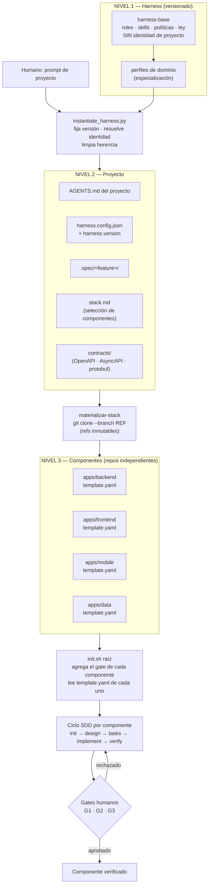

# Propuesta — Harness instanciable

> **Estado**: propuesta en curso · **Fecha**: 2026-09-25 · **Revisión**: 2026-09-26
> **Decisor**: Juan Moreno (responsable del harness) · **Co-firma A4**: revisión Tech Lead humano
> **Naturaleza**: documento de referencia. Registra las decisiones tomadas y las abiertas sobre cómo
> convertir este repositorio en un **framework de desarrollo reutilizable**. Forma parte de la
> historia de construcción del harness.
>
> **Estructura**: §1–§10 contexto y decisiones · §11 decisiones abiertas · §12–§13 anexos de
detalle (A3, A4) · §14 documentos relacionados.

---

## 1. Objetivo

Convertir este repositorio en un **framework de SDLC agéntico** reutilizable en cualquier
desarrollo (backend, frontend, full stack, móvil) **sin depender de la tecnología** ni del modelo
de lenguaje.

El objetivo declarado por el responsable del harness:

> Guardar la arquitectura del harness en un repositorio versionado; al iniciar un proyecto,
> instanciarla y crear los repositorios de cada componente a partir de **templates maduros**,
> y desarrollar con el ciclo SDD.

---

## 2. El problema del modelo inicial

El modelo mental original tenía **dos niveles**: el harness y el proyecto. Con esa topología, el
harness y el proyecto compiten por el mismo árbol de directorios, y aparecen tres conflictos:

| Conflicto | Evidencia |
| :--- | :--- |
| **Identidad heredada** | `harness.config.json` declara `"name": "deepseek-harness"`, que no es el nombre de este repositorio (`AI-Harness-Architecture`). Un proyecto instanciado hereda el nombre de otro |
| **Historia ajena** | `.spec/_harness/ADR/001..003` son decisiones de *este* harness. Un proyecto nuevo arrancaría con deuda y decisiones que no le pertenecen |
| **Colisión normativa** | R4 protege `AGENTS.md`, `.harness/**` y `.agents/**` contra escritura, pero un harness *debe* adaptarse al proyecto. Dos leyes compitiendo en el mismo árbol |

A esto se suma un cuarto problema, medido, no teórico:

| Artefacto con versión | Valor actual |
| :--- | :--- |
| `AGENTS.md` → "Versión del contrato" | `1.0.0` |
| `harness.config.json` → `version` | `1.0.0` |
| `.harness/models.yaml` → `version` | `1.2.0` |
| `.harness/providers.yaml` → `version` | `1.1.0` |
| `.harness/routing.yaml` → `version` | `1.0.0` |

**Cinco versiones independientes, sin coordinación y sin ninguna que represente al harness.** No
existe un identificador único que un proyecto pueda fijar. `scripts/validate_harness.py` **no
comprueba** la coherencia entre ellas.

> Consecuencia: hoy **no se puede fijar la versión del harness**. La primera decisión del humano
> —"debe mantenerse versionado para no perder enlace con los proyectos"— es, en el estado actual,
> **inejecutable**.

---

## 3. Modelo propuesto: tres niveles

| Nivel | Qué es | Responsable de | Cambia |
| :--- | :--- | :--- | :--- |
| **1. Harness** | **Cómo** se trabaja: roles, skills, políticas, ley, gates | Definición agnóstica de componente y de tecnología | Rara vez, con semver |
| **3. Repositorio** | **Qué** se construye **y** con qué: el componente o el harness mismo | Un repo por unidad de mantenimiento | Por componente |

> **Revisión 2026-09-28 (ADR-012)**: el «nivel 2 — Proyecto» **se elimina**. Era un contenedor
> inventado para ubicar el contrato; en el escenario real los componentes **no se relacionan entre sí**
> y no hay alcance de aplicación. Existe **un solo nivel de instanciación: el repositorio**, que
> contiene todo lo necesario para su mantenimiento (ley, método, gate, `.spec/` y versión del harness).
> El contrato es **propiedad del componente proveedor** y el consumidor lo referencia **con pin**.
>
> Ver **ADR-012** para el detalle y las consecuencias.

El nivel 1 se **instancia** en un repositorio. Esa es la única relación jerárquica.

### El patrón se aplica por tercera vez

Este modelo no es nuevo en el repositorio: es el **mismo patrón** que ya se aplicó dos veces, y
ambas están verificadas por comando (85 comprobaciones).

| Capa | Modelos (hecho) | Skills (hecho) | Harness (propuesto) |
| :--- | :--- | :--- | :--- |
| **Definición agnóstica** | Rol `.md` (sin modelo) | `SKILL.md` (sin modelo) | Harness base (sin proyecto) |
| **Selección por instancia** | `.harness/models.yaml` | `skills:` del rol | Instancia de proyecto |
| **Adaptador / artefacto** | `.github/agents/` | — | `apps/*/` clonados |

Si el patrón funcionó dos veces, es el patrón correcto para la tercera.

---

## 4. Diagrama del flujo propuesto



---

## 5. Decisiones tomadas

### D1 — El harness se **instancia** para iniciar un proyecto, y se mantiene versionado

**Decisión**: el harness se instancia (no se copia sin control) y conserva un enlace de versión con
los proyectos y componentes que origina, para poder actualizarlos a lo largo del tiempo.

**Consecuencia inmediata**: hace falta un **identificador único de versión del harness**. Las cinco
versiones actuales (§2) no sirven porque ninguna representa al conjunto, y pueden divergir sin que
nada lo detecte.

**Decidido** (ADR-004): `.harness/harness.version` como único punto de verdad, agregando las cinco
versiones de los artefactos, con un check en el validador que **falla si alguna diverge**.

> Toca `.harness/**` y `harness.config.json` → **R4: PR separada con aprobación humana**.

### D2 — Un solo harness base; la especialización por dominio vive en el nivel 3

> **Revisión 2026-09-27**: la decisión original de D2 —perfiles de dominio que **heredan** del base—
> queda **reemplazada** por ADR-005. Se conserva aquí el análisis que la motivó porque explica por qué
> la conclusión final es la opuesta.

**Decisión original**: existirían varios harness especializados por tipo de componente, con un
mecanismo de herencia desde un base compartido para evitar que cada dominio derivara en un fork.

**Problema del riesgo que la herencia venía a mitigar.**

Multiplicar harness por dominio reproduce **exactamente el mismo riesgo de divergencia** que
"copiar el harness por proyecto" (§2). Si cada dominio es un repositorio independiente, en seis
meses hay cinco harness incompatibles y ninguna lección compartida.

Mitigación que se propuso entonces — **herencia explícita, no forks independientes**:

```
harness-base                    ← el núcleo: roles, skills, políticas, gates
├── dominio/backend-service     ← especializa: stack por defecto, skills extra, gate
├── dominio/web-frontend
└── dominio/mobile
```

Los perfiles de dominio heredarían del base y solo declararían su **delta**.

**Dos reglas duras del mecanismo de perfiles:**

1. **Un perfil solo añade o restringe. Nunca contradice al base.** Si un perfil necesita contradecir
   al base, esa es la señal de que la diferencia debe promoverse al base como opción, o de que la
   herencia es la herramienta equivocada para ese dominio.
2. **Los perfiles se EXTRAEN, no se diseñan.** Un perfil nace cuando el segundo proyecto de otro tipo
   revele el delta real. Antes de eso, un perfil es una hipótesis disfrazada de arquitectura.

#### Dónde vive realmente la diferencia entre dominios

Es un error frecuente suponer que backend, frontend y mobile necesitan harness distintos. Al
clasificar las diferencias por nivel, casi todas caen en el **nivel 3 (componente)**, no en el nivel 1:

| Diferencia real entre backend / frontend / mobile | Nivel donde vive |
| :--- | :--- |
| Comandos del gate (`mvn verify` · `npm test` · `flutter test`) | **Nivel 3** — `template.yaml` |
| Rutas escribibles (`src/main/java` · `src/components` · `lib/`) | **Nivel 3** — `extensions` del template |
| Conocimiento idiomático (Spring · React · Flutter) | **Nivel 3** — `agent_profile.md` |
| Template a clonar | **Nivel 3** — `stack.md` |
| **Rol, fases SDD, gates G1–G3, R1–R10, arranque en frío** | **Igual en los tres** |

**Los roles no cambian.** `sdd-init` convierte una petición vaga en criterios verificables igual si
el destino es Java o Flutter: su prompt no menciona tecnología, y eso está verificado por comando.
La pregunta correcta no es *«¿necesito otro harness para frontend?»* sino *«¿qué necesita frontend
que no tenga ya?»*. La respuesta honesta hoy es **skills adicionales** (accesibilidad, regresión
visual) y **checks adicionales del gate** (presupuesto de bundle): eso es **aditivo**, no estructural.

**Mobile es el caso que rompe la simetría**, y conviene tenerlo presente:

- Firma de artefactos y gestión de certificados.
- Revisión de tiendas (App Store / Play) como gate externo.
- Matriz de dispositivos y versiones de SO soportadas.
- Verificación que requiere emulador o simulador, no solo unit tests.

Nada de eso cambia los roles ni las fases: son **checks del gate y una skill extra**. Es decir,
incluso el dominio más distinto se resuelve con **overlay**, no con un harness nuevo.

#### El riesgo de secuencia (argumento decisivo)

Hoy el proyecto tiene **cero aplicaciones**. El harness base nunca ha pasado de la fase init, el gate
está inerte y hay **cinco versiones divergentes sin check de coherencia** (§2).

Crear tres harness de dominio ahora **multiplica por tres la coordinación de algo que aún no funciona
una vez**, y lo hace *especulando* sobre diferencias no medidas. El principio de ingeniería aplicable:
**no se extrae la abstracción hasta tener la segunda o tercera instancia real**. El propio repositorio
lo demuestra: los cinco artefactos con versión divergieron precisamente por crearse por separado sin
un check que los coordinara.

#### Decisión final — sin herencia, sin perfiles

**No existe mecanismo de herencia ni hay varios harness. Hay un solo harness base, y toda la
especialización por dominio se traslada al nivel 3 (el componente)** (ADR-005).

La especialización se expresa en tres sitios, todos del componente:

1. **`commands`** — el gate de cada componente declara sus propios comandos (`lint`, `tests`, `gate`).
2. **`extensions`** — las rutas donde el agente puede escribir, declaradas por el componente.
3. **`agent_profile.md`** — el conocimiento idiomático de la tecnología (convenciones, anti-patrones,
   recetas de test), versionado junto al código que describe.

**Regla de promoción**: si un dominio necesita algo que el base no puede expresar, la discusión es
*«¿debe el base ganar esa opción?»*, no *«creemos otro harness»*. Si la respuesta fuera «creemos otro
harness», eso indicaría que el base es la abstracción equivocada, y el caso se lleva a un ADR nuevo.

**Se elimina así el trabajo de construir un mecanismo de herencia**, y el delta se va donde el
análisis demostró que corresponde.

### D3 — Ciclo completo para aplicaciones, modo ligero para infraestructura

**Decisión**: los componentes de **infraestructura** usan un modo ligero; los componentes de
**aplicación** pasan por el ciclo SDD completo.

| Aspecto | Aplicación | Infraestructura (ligero) |
| :--- | :--- | :--- |
| Fases SDD | `init → design → tasks → implement → verify` | `init → design → implement` |
| `design.md` | Completo (interfaces, alternativas, riesgos) | Mínimo (qué, por qué, cómo se verifica) |
| `tasks/` | Una tarea por archivo, 1 commit cada una | Sin descomposición formal |
| Gates humanos | G1 + G2 + G3 | G1 (alcance) + revisión del diff |
| Verificación | `verify.md` con trazabilidad AC↔código | Gate del componente + revisión |
| Adaptadores de agente | Todos | Subconjunto |

> El modo ligero **no** relaja la ley: aplican R1 (nada de código sin spec), R6 (`init.sh` como
> único gate), R7 (no se debilitan tests) y R9 (sin secretos). Lo que se ajusta es la **ceremonia**,
> no las garantías.

---

## 6. Topologías de consumo del harness

| Opción | Ventaja | Problema | Veredicto |
| :--- | :--- | :--- | :--- |
| **A. Clonar y commitear dentro del proyecto** | Un solo repo, simple | Divergencia garantizada: cada proyecto forkea y el upgrade se vuelve merge manual que nadie hace | Aceptable solo para una prueba única |
| **B. Submódulo git** | Referencia por versión explícita | Submódulos frágiles; herramientas y CLIs no leen bien `.agents/` y `AGENTS.md` en submódulo | Descartado |
| **C. Instanciar una versión fijada** | Proyecto autónomo; **sabes de qué versión viene**; upgrade como comando explícito | Requiere mantener el script de instanciación y la noción plantilla/instancia | **Recomendado** |

**Nota sobre GitHub**: el mecanismo correcto es **template repository**, no *fork*. Un template
genera un repositorio **sin historia compartida**; un fork la comparte, y lo que se busca es
independencia.

### Qué debe hacer `instantiate_harness.py`

1. **Fijar la versión** del harness (semver o SHA), nunca "lo último".
2. **Resolver identidad**: nombre del proyecto, remoto, ramas protegidas, idioma de la ley.
3. **Limpiar herencia**: `.spec/` vacío, sin ADRs del harness, `README.md` propio, `name` correcto.
4. **Dejar el enlace auditable**: registrar la versión del harness en el proyecto.

---

## 7. El eje de stack encaja como nivel 3

Lo diseñado en `docs/desacoplamiento-arquitectura-software.md` **es el mecanismo del nivel 3**:

```
.spec/<feature>/stack.md    →  declara: backend en Go, web en React, datos en Postgres,
                               con repository + ref inmutable por componente
apps/                       →  materializado por git clone
apps/*/template.yaml        →  cada componente se describe a sí mismo:
                               comandos del gate, rutas escribibles, perfil del agente
```

Con esto, `init.sh` deja de **adivinar** el stack (`if [ -f package.json ] … elif [ -f go.mod ]`)
y pasa a **leer** lo que cada componente declara. Es la diferencia entre inferir y verificar.

---

## 8. Riesgos del nuevo flujo

| Riesgo | Por qué duele | Mitigación |
| :--- | :--- | :--- |
| **Deriva de versión del harness** | 5 proyectos con 5 versiones divergentes | **Resuelto** (ADR-004): versión única + check que falla si diverge |
| **Templates que se pudren** | Runtimes EOL, CVEs acumuladas | Suite de conformidad antes de admitir un template |
| **Clonar código de terceros ejecuta código** | `postinstall`, hooks de git = ejecución remota | Allowlist de hosts + prohibición de scripts de instalación (coherente con la prohibición de `curl \| sh` ya vigente) |
| **N identidades de gate** | Cada componente con su `init.sh` | Agregación jerárquica; el gate raíz es el **único** veredicto |
| **Coste multi-repo** | 4 componentes × 5 fases = 20 ciclos | D3: modo ligero para infraestructura |
| **Ambigüedad de "harness por dominio"** | Puede derivar en N harness incompatibles | **Resuelto** (ADR-005): un solo base; la especialización vive en el nivel 3 |

---

## 9. Estado actual medido

Verificado el 2026-09-25, no inferido:

| Comprobación | Resultado |
| :--- | :--- |
| `design.md`, `tasks/`, `verify.md` en cualquier feature | **Ninguno** |
| Directorios `src/`, `lib/`, `app/`, `tests/` | **Ninguno existe** |
| `.venv`, `pyproject.toml` | **No existen** |
| `ruff`, `mypy`, `pytest` | **Ausentes** |
| Remoto git | **Vacío** (R3 no es ejecutable) |
| `scripts/**` en `writable_paths` de algún rol | **No** (bloquea `validator-runner` y el materializador) |
| Checks de `init.sh` (`lint`, `format`, `typecheck`, `tests`) | **`SKIP`** → el gate dice PASS sin comprobar nada |
| Rol con permiso de escritura en `scripts/**` | **Ninguno** (ver anexo B, §13) |

**El flujo SDD nunca ha pasado de la fase init.** La arquitectura está definida y verificada en su
capa de definición, pero **nunca se ha ejercitado** con código real.

Esto tiene una consecuencia sobre el orden de trabajo: los huecos de esta tabla se han **derivado
leyendo** el repositorio. Una ejecución real los **demostraría**, y probablemente revele otros que no
es posible anticipar sin correr el flujo (ver §10, paso 4).

---

## 10. Orden de implementación propuesto

| Paso | Qué | Por qué aquí |
| :--- | :--- | :--- |
| **0** | Reclasificar `validator-runner` como chore del harness | Es una automatización de `scripts/`, no una feature de dominio. Su ceremonia de 5 supuestos abiertos no le corresponde |
| **1** | **Activar el gate**: `.venv`, manifiesto, herramientas, remoto | Sin esto, nada de lo demás es verificable: el gate daría PASS sin comprobar |
| **2** | **Versión única del harness** (D1) | Hace el harness instanciable de verdad |
| **3** | **`instantiate_harness.py`** | Convierte el harness en reutilizable |
| **4** | **Primera aplicación real**, un solo componente, ciclo completo | Prueba las 4 fases end-to-end |
| **5** | **Segunda aplicación de otro tipo** (frontend o segundo backend de otra tecnología) | Es lo que **revela el delta real** entre dominios. Sin esta evidencia no hay especialización que extraer (ADR-005) |
| **6** | **Materializador de stack** (nivel 3) + templates | Multi-componente. Es donde vive la especialización por dominio |

> El paso 4 es el que aporta la información que **no se puede obtener leyendo**: los huecos que solo
> aparecen cuando el flujo se ejecuta. El paso 6 debería llegar **después** del 5, para no hornear
> supuestos en `AGENTS.md`, que es el sitio más caro de cambiar.
>
> A4 (§13) condiciona el paso 1 y **también** el paso 6: el materializador necesita escribir en
> `scripts/`, y hoy ningún rol tiene permiso ahí (resuelto por ADR-007 con el rol `harness-maintainer`).

---

## 11. Decisiones abiertas

> **Cómo se cierra una decisión**: la columna *Respuesta* pasa de `Abierta` a
> `Cerrada <fecha> — <decisión>` y, si la decisión tiene alternativas reales, se registra un ADR
> (columna *ADR*). Mientras esté `Abierta`, la decisión bloquea el paso indicado en *Antes de*.

| # | Decisión | Quién decide | Antes de | Respuesta | ADR |
| :--- | :--- | :--- | :--- | :--- | :--- |
| A1 | Forma del identificador único de versión del harness (§5, D1) | Juan Moreno | paso 2 | `Cerrada 2026-09-27 - Es unico mediante .harness/harness.version + check de coherencia en el validador. Agrega las 5 mas y si falla diverge ` | pendiente |
| A2 | Mecanismo de herencia base → perfil de dominio (§5, D2) | Juan Moreno | paso 5 | `Cerrada 2026-09-27 - Sin herencia, un solo archivo base la diferencia entre dominios se traslada al Nivel 3 (componente)` | pendiente |
| A3 | ¿`AGENTS.md` del proyecto propio o derivado? (anexo A) | Juan Moreno | paso 3 | `Cerrada 2026-09-27 - El AGENTS.md es derivado y se genera desde (Ley base + parameros del proyecto). Requiere generador y marcar archivo como no Editable` | pendiente |
| A4 | ¿`scripts/**` escribible por el Developer? (anexo B) | Juan Moreno + revisión Tech Lead | paso 1 | `Cerrada 2026-09-27 - No. Crear un nuevo Rol harness-maintainer. Rol con writable_paths: [scripts/**, .harness/**, .agents/**], obligado a PR + revisión humana` | pendiente |
| A5 | ¿Todo componente de aplicación merece ciclo completo, o hay umbral por tamaño? | Juan Moreno (Product Owner) | paso 5 | `Cerrada 2026-09-27 - Si. Todo componentes de aplicación merece ciclo completo sin importar su tamaño` | pendiente |
| A6 | Primera aplicación de prueba y su stack | Juan Moreno (Product Owner) | paso 4 | `Cerrada 2026-09-27 - La primera aplicación de prueba sera un Modulo de autenticación con correo y password utilizando Laravel 12 con PHP 8.2 composer. Dame una guia completa para lograr este objetivo ya que pasara a ser un template estandar para iniciar proyectos nuevos basado en Hernes instanciable` | pendiente |
| A7 | ¿Se crea remoto git para que R3 (PR) sea ejecutable? | Juan Moreno | paso 1 | `Cerrada 2026-09-27 - Si. Remoto privado en Github. Dame el plan y los pasos a seguir para conseguir el repo remoto` | pendiente |

### Qué decisor corresponde a cada decisión

La asignación no es arbitraria: sigue la lógica de gates de `AGENTS.md` §7.

| Decisión | Decisor | Por qué esa persona |
| :--- | :--- | :--- |
| A1, A2, A3 | Juan Moreno (responsable del harness) | Tocan la ley y `.harness/**` — §9 exige aprobación humana explícita |
| A4 | Juan Moreno + Tech Lead humano | Toca `.agents/policies/permissions.yaml` — es un cambio de governance, como G2 |
| A5 | Juan Moreno como Product Owner | Define el ciclo de vida del producto |
| A6 | Juan Moreno como Product Owner | Es el alcance de la primera feature: gate G1 |
| A7 | Juan Moreno | Infraestructura del repositorio |

> **Nota**: la columna *Quién decide* lleva **nombre**, no un rol genérico, porque «Humano
> responsable» no permite saber a quién preguntar. Si se delega una decisión, el nombre se actualiza.

---

## 12. Anexo A — A3 en detalle: `AGENTS.md` del proyecto

### La tensión real

`AGENTS.md` es la ley y **todo agente debe leerlo como precondición** (§0 y §6 de la ley). Pero ese
archivo **ya es hoy una mezcla** de dos naturalezas distintas:

| Sección de `AGENTS.md` | Naturaleza | ¿Debería cambiar por proyecto? |
| :--- | :--- | :--- |
| §1 Reglas de oro R1–R10 | **Ley** | **No.** Es el contrato del método |
| §2 Estándares de código | Ley | No (con matiz: el idioma de los comentarios sí) |
| §3 Convenciones de nombres (ramas, commits) | Ley | No |
| §4 Estructura del repositorio | **Mixta** | Referencia `.agents/`, `.harness/` (harness) **y** `src/`, `tests/` (proyecto) |
| §5 Definition of Done | Ley | No |
| §6 Protocolo de subagentes | Ley | No |
| §7 Gates G1–G3 | Ley | No |
| §8 Criterios del Verifier | Ley | No |
| §9 ADRs y cambios a la ley | Ley | No |

**§4 es el síntoma**: un archivo de ley describiendo `src/`. Es ley conteniendo datos de proyecto.
Ahí está exactamente A3.

### Las cuatro opciones, con su coste

| Opción | Cómo | Problema |
| :--- | :--- | :--- |
| **a. Copia completa por proyecto** | Cada proyecto tiene su `AGENTS.md` íntegro y autónomo | **Drift garantizado**: mejorar R5 obliga a actualizar N archivos. Y peor: el proyecto puede editar su propia ley, que es justo lo que R4 intenta impedir |
| **b. Referencia fina** | `AGENTS.md` del proyecto declara la versión del harness y referencia la ley base | El agente debe leer dos archivos. Además, los subagentes de Copilot **no leen `AGENTS.md` automáticamente** — ya se resolvió incrustando la ley en los `.agent.md` |
| **c. Generado** | `AGENTS.md` del proyecto se **genera** desde (ley base + parámetros del proyecto) | Requiere generador y marcar el archivo como no editable |
| **d. Partido** | Ley inmutable en el harness + `project.yaml` con lo específico | Dos sitios; hay que resolver qué lee el agente |

### Recomendación: opción (c), y hay precedente en el propio código

El argumento decisivo no es teórico: **el repositorio ya aceptó este patrón**. `sync-adapters.sh`
hace exactamente esto con los agentes:

```bash
echo "<!-- GENERADO por scripts/sync-adapters.sh — NO EDITAR A MANO."
echo "## Ley del repositorio (AGENTS.md) — normativa, prevalece sobre todo lo demás"
sed -n '/^## 0\./,$p' "$LAW"
```

Incrusta la ley en cada `.agent.md` y lo marca como generado. **El precedente, la convención y el
mecanismo ya existen.**

Con la opción (c), el drift se controla igual que ya se controla con los adaptadores: **un check que
falla si el generado diverge**, con la misma forma que `sync-adapters.sh --check`. Es decir,
`instantiate_harness.py --check` verificaría que el `AGENTS.md` del proyecto corresponde a la versión
declarada del harness.

### La separación conceptual que lo hace limpio

| Contenido | Dónde vive | Naturaleza |
| :--- | :--- | :--- |
| **Reglas** (R1–R10, gates, protocolo en frío) | Harness base, versionado | Ley — no se edita por proyecto |
| **Parámetros** (nombre, ramas, rutas, stack, comandos) | `harness.config.json` / `project.yaml` | Datos — sí cambian por proyecto |
| **`AGENTS.md` del proyecto** | Generado de ambos | Artefacto, con cabecera «NO EDITAR A MANO» |

Esta separación responde a A3 y de paso corrige §4: la estructura del repositorio deja de ser **ley**
y pasa a ser **parámetro**, porque en un proyecto multi-componente las rutas dependen del stack.

---

## 13. Anexo B — A4 en detalle: qué puede escribir el Developer

### La regla general que resuelve todos los casos

> **El Developer no puede escribir nada que el Verifier use como evidencia de su trabajo.**

Es la misma lógica que R7 (*prohibido debilitar tests*). Si el Developer puede editar
`validate_harness.py`, puede hacer que su propio juez lo declare inocente. Es un **conflicto de
interés estructural**, no un problema de confianza.

Por eso **abrir `scripts/**` en bloque es un error de governance**, aunque parezca la solución obvia:
`validate_harness.py` e `init.sh` viven ahí, y son las herramientas con las que el Verifier juzga.

### Clasificación de casos

| Caso de uso | ¿Escribe el Dev? | Dónde debe vivir | Por qué |
| :--- | :--- | :--- | :--- |
| Utilidad de desarrollo (seed de BD, generador de fixtures, cliente del API) | **Sí** | `tools/` (ruta nueva, escribible) | Es código de proyecto, no del harness |
| Runner de migraciones de esquema | **Sí** | `tools/` o el componente | Ídem |
| Script de build/deploy del componente | **Sí** | Dentro del componente | El `template.yaml` lo declara en `extensions` |
| Código generado (cliente del contrato, tipos) | **Sí, regenerado** | El componente | Es output, no autoría |
| `validate_harness.py`, `harness_yaml.py`, `diagnose_harness.py` | **NO** | `scripts/` protegido | **Son el juez.** Conflicto de interés |
| `init.sh` como gate | **NO** | Raíz protegida | R6 + conflicto de interés |
| `sync-adapters.sh` | **NO** | `scripts/` protegido | R4 explícito |
| `resolve-stack.py`, `materialize-stack.sh` | **NO por el Dev** | `scripts/` protegido | Herramientas del harness |
| Cualquier check que lea el Verifier | **NO** | Protegido | Regla general de arriba |

### Cómo se construyen entonces el runner y el materializador

| Camino | Descripción | Veredicto |
| :--- | :--- | :--- |
| **1. Rol nuevo `harness-maintainer`** | Rol con `writable_paths: [scripts/**, .harness/**, .agents/**]`, obligado a PR + revisión humana | **Recomendado.** Separa responsabilidades de verdad: quien escribe el harness no es quien implementa la aplicación |
| **2. PR autorada por humano** | Un humano escribe el cambio del harness | Funciona, pero ata el harness al tiempo disponible del humano |
| **3. `scripts/**` abierto + lista negra** | Abrir todo y proteger archivos concretos | **Descartado.** Una deny-list envejece mal: cada script nuevo del harness queda escribible por olvido. Y contradice el modelo **deny-first** que ya declara `permissions.yaml` |

**Coherencia con lo ya existente**: la política actual dice *«lo que no está explícitamente permitido,
está prohibido»* (allowlist). Abrir `scripts/**` con una lista negra sería **cambiar de modelo de
permisos** para resolver un caso puntual — exactamente el tipo de decisión que conviene registrar
en un ADR.

**Nota sobre el nombre de la carpeta.** Si `tools/` es la superficie de proyecto, hay que decidirlo
junto con el template: ¿`tools/` en la raíz del proyecto o dentro de cada componente? Sugerencia:
**dentro del componente**, porque cada uno tiene su lenguaje y su runner — y así su `template.yaml`
declara `extensions: [tools/**]` y nadie tiene que ampliar la política por dominio.

---

## 14. Documentos relacionados

- [`docs/desacoplamiento-arquitectura-software.md`](./desacoplamiento-arquitectura-software.md) — diseño del eje declarativo de stack (nivel 3)
- [`AGENTS.md`](../AGENTS.md) — ley del repositorio (R1–R10, gates G1–G3)
- [`.spec/_harness/ADR/`](../.spec/_harness/ADR/README.md) — decisiones ya registradas (ADR-001 a 003)
- [`README.md`](../README.md) — estado del harness y diagnóstico
